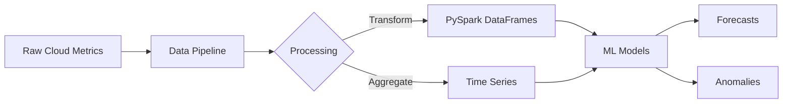
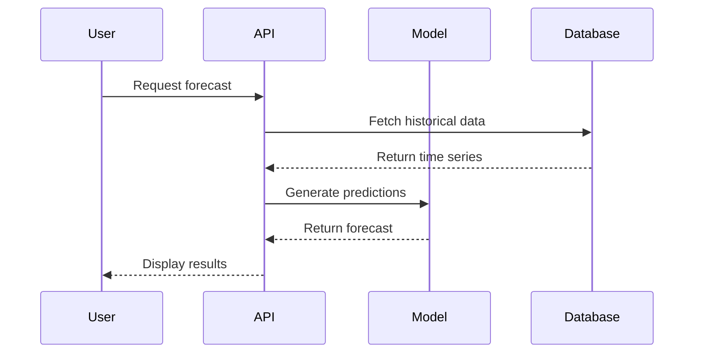

# Formatting Examples

This page demonstrates all available formatting features in Material for MkDocs. Each section shows the rendered output followed by the source code.

---

## Text Formatting

### Basic Text Styling

**Bold text** is important for emphasis.

*Italic text* provides subtle emphasis.

***Bold and italic*** for maximum emphasis.

~~Strikethrough~~ for deprecated content.

==Highlighted text== draws attention.

H~2~O shows subscript, and X^2^ shows superscript.

```markdown
**Bold text** is important for emphasis.

*Italic text* provides subtle emphasis.

***Bold and italic*** for maximum emphasis.

~~Strikethrough~~ for deprecated content.

==Highlighted text== draws attention.

H~2~O shows subscript, and X^2^ shows superscript.
```

### Keyboard Keys

Press ++ctrl+alt+del++ to restart.

```markdown
Press ++ctrl+alt+del++ to restart.
```

---

## Headings

# Heading 1 - Page Title
## Heading 2 - Major Section
### Heading 3 - Subsection
#### Heading 4 - Sub-subsection
##### Heading 5 - Minor Point
###### Heading 6 - Smallest Heading

```markdown
# Heading 1 - Page Title
## Heading 2 - Major Section
### Heading 3 - Subsection
#### Heading 4 - Sub-subsection
##### Heading 5 - Minor Point
###### Heading 6 - Smallest Heading
```

---

## Lists

### Unordered Lists

- Cloud resource monitoring
- Time series forecasting
  - Gaussian Processes
  - Foundation models
    - Chronos
    - TimesFM
- Anomaly detection

```markdown
- Cloud resource monitoring
- Time series forecasting
  - Gaussian Processes
  - Foundation models
    - Chronos
    - TimesFM
- Anomaly detection
```

### Ordered Lists

1. Install dependencies with `uv sync`
2. Run tests with `pytest`
3. Build documentation
   1. Run `mkdocs serve` for preview
   2. Run `mkdocs build` for static site
4. Deploy to production

```markdown
1. Install dependencies with `uv sync`
2. Run tests with `pytest`
3. Build documentation
   1. Run `mkdocs serve` for preview
   2. Run `mkdocs build` for static site
4. Deploy to production
```

### Task Lists

- [x] Implement Gaussian Process model
- [x] Add PySpark integration
- [ ] Complete foundation model wrappers
- [ ] Write comprehensive tutorials

```markdown
- [x] Implement Gaussian Process model
- [x] Add PySpark integration
- [ ] Complete foundation model wrappers
- [ ] Write comprehensive tutorials
```

---

## Links & Buttons

### Basic Links

Visit our [GitHub repository](https://github.com/nehalecky/hello-cloud) for source code.

Read the [Gaussian Process Design](../concepts/design/gaussian-process-design.md) document.

```markdown
Visit our [GitHub repository](https://github.com/nehalecky/hello-cloud) for source code.

Read the [Gaussian Process Design](../concepts/design/gaussian-process-design.md) document.
```

### Styled Buttons

[Get Started :fontawesome-solid-rocket:](#){ .md-button .md-button--primary }

[View on GitHub :fontawesome-brands-github:](https://github.com/nehalecky/hello-cloud){ .md-button }

```markdown
[Get Started :fontawesome-solid-rocket:](#){ .md-button .md-button--primary }

[View on GitHub :fontawesome-brands-github:](https://github.com/nehalecky/hello-cloud){ .md-button }
```

---

## Code

### Inline Code

Use `WorkloadPatternGenerator` to create synthetic data with `generate_time_series()`.

```markdown
Use `WorkloadPatternGenerator` to create synthetic data with `generate_time_series()`.
```

### Code Blocks with Syntax Highlighting

```python title="generate_cloud_metrics.py" linenums="1"
from hellocloud.data_generation import WorkloadPatternGenerator, WorkloadType
from datetime import datetime, timedelta

# Generate realistic web app metrics
generator = WorkloadPatternGenerator()
data = generator.generate_time_series(
    workload_type=WorkloadType.WEB_APP,
    start_time=datetime.now() - timedelta(days=30),
    end_time=datetime.now(),
    interval_minutes=60
)
```

````markdown
```python title="generate_cloud_metrics.py" linenums="1"
from hellocloud.data_generation import WorkloadPatternGenerator, WorkloadType
from datetime import datetime, timedelta

# Generate realistic web app metrics
generator = WorkloadPatternGenerator()
data = generator.generate_time_series(
    workload_type=WorkloadType.WEB_APP,
    start_time=datetime.now() - timedelta(days=30),
    end_time=datetime.now(),
    interval_minutes=60
)
```
````

### Code with Line Highlighting

```python hl_lines="5-10"
from hellocloud.ml_models.gaussian_process import SparseGPModel

# Prepare data
train_df = df.filter(F.col('date') < '2024-01-01')
test_df = df.filter(F.col('date') >= '2024-01-01')

# Train GP model - these lines are highlighted
model = SparseGPModel(
    num_inducing=100,
    fast_period=24.0,  # Daily pattern
    slow_period=168.0   # Weekly pattern
)
model.fit(train_df)

# Forecast
predictions = model.predict(test_df)
```

````markdown
```python hl_lines="7-11"
# Code here...
```
````

### Code with Annotations

```python
from hellocloud.data_generation import WorkloadPatternGenerator

generator = WorkloadPatternGenerator()
data = generator.generate_time_series(
    workload_type=WorkloadType.WEB_APP,  # (1)!
    interval_minutes=60  # (2)!
)
```

1. Choose from 20+ workload types including `WEB_APP`, `BATCH_JOB`, `MICROSERVICE`, `DATABASE`, and more.
2. Data granularity in minutes. Use 60 for hourly data, 1440 for daily.

````markdown
```python
from hellocloud.data_generation import WorkloadPatternGenerator

generator = WorkloadPatternGenerator()
data = generator.generate_time_series(
    workload_type=WorkloadType.WEB_APP,  # (1)!
    interval_minutes=60  # (2)!
)
```

1. Choose from 20+ workload types including `WEB_APP`, `BATCH_JOB`, `MICROSERVICE`, `DATABASE`, and more.
2. Data granularity in minutes. Use 60 for hourly data, 1440 for daily.
````

---

## Admonitions

### Note

!!! note "Research Foundation"
    Our synthetic data generation is based on empirical research showing 12-15% average CPU utilization across cloud infrastructure.

```markdown
!!! note "Research Foundation"
    Our synthetic data generation is based on empirical research showing 12-15% average CPU utilization across cloud infrastructure.
```

### Warning

!!! warning "Resource Requirements"
    Foundation models require significant memory. TimesFM needs at least 16GB RAM and is not compatible with Apple Silicon.

```markdown
!!! warning "Resource Requirements"
    Foundation models require significant memory. TimesFM needs at least 16GB RAM and is not compatible with Apple Silicon.
```

### Tip

!!! tip "Performance Optimization"
    Use sparse Gaussian Processes with inducing points for datasets larger than 10,000 observations.

```markdown
!!! tip "Performance Optimization"
    Use sparse Gaussian Processes with inducing points for datasets larger than 10,000 observations.
```

### Danger

!!! danger "Production Warning"
    Never commit real cloud credentials or API keys to the repository.

```markdown
!!! danger "Production Warning"
    Never commit real cloud credentials or API keys to the repository.
```

### Success

!!! success "Test Coverage"
    The Gaussian Process library has achieved 92% test coverage!

```markdown
!!! success "Test Coverage"
    The Gaussian Process library has achieved 92% test coverage!
```

### Info

!!! info "PySpark Requirement"
    This library requires Java 21 for PySpark 4.0. Install with `brew install openjdk@21`.

```markdown
!!! info "PySpark Requirement"
    This library requires Java 21 for PySpark 4.0. Install with `brew install openjdk@21`.
```

### Example

!!! example "Quick Start"
    ```python
    from hellocloud.timeseries import TimeSeries

    ts = TimeSeries.from_parquet("cloud_metrics.parquet")
    daily = ts.aggregate("daily", value_col="cpu_utilization")
    ```

````markdown
!!! example "Quick Start"
    ```python
    from hellocloud.timeseries import TimeSeries

    ts = TimeSeries.from_parquet("cloud_metrics.parquet")
    daily = ts.aggregate("daily", value_col="cpu_utilization")
    ```
````

### Quote

!!! quote "Industry Research"
    "The average server operates at no more than 12 to 18 percent capacity" - McKinsey, 2023

```markdown
!!! quote "Industry Research"
    "The average server operates at no more than 12 to 18 percent capacity" - McKinsey, 2023
```

### Collapsible Admonitions

??? note "Expandable Details"
    Click to see more information about cloud resource patterns.

    - CPU: 12-15% average utilization
    - Memory: 18-25% average utilization
    - Waste: 25-35% of cloud spending

```markdown
??? note "Expandable Details"
    Click to see more information about cloud resource patterns.

    - CPU: 12-15% average utilization
    - Memory: 18-25% average utilization
    - Waste: 25-35% of cloud spending
```

---

## Content Tabs

### Basic Tabs

=== "Python"

    ```python
    # Python implementation
    from hellocloud import WorkloadPatternGenerator

    generator = WorkloadPatternGenerator()
    data = generator.generate_time_series()
    ```

=== "Bash"

    ```bash
    # Install with uv
    uv sync --all-extras

    # Run tests
    uv run pytest tests/ -v
    ```

=== "YAML"

    ```yaml
    # Configuration
    workload:
      type: web_app
      cpu_mean: 15.0
      memory_mean: 25.0
    ```

````markdown
=== "Python"

    ```python
    # Python implementation
    from hellocloud import WorkloadPatternGenerator

    generator = WorkloadPatternGenerator()
    data = generator.generate_time_series()
    ```

=== "Bash"

    ```bash
    # Install with uv
    uv sync --all-extras

    # Run tests
    uv run pytest tests/ -v
    ```

=== "YAML"

    ```yaml
    # Configuration
    workload:
      type: web_app
      cpu_mean: 15.0
      memory_mean: 25.0
    ```
````

---

## Tables

### Basic Table

| Model | Type | Use Case | Performance |
|-------|------|----------|-------------|
| Gaussian Process | Probabilistic | Uncertainty quantification | High accuracy |
| Chronos | Foundation | Zero-shot forecasting | Good generalization |
| TimesFM | Foundation | Long-horizon forecasting | State-of-the-art |
| ARIMA | Statistical | Traditional time series | Baseline |

```markdown
| Model | Type | Use Case | Performance |
|-------|------|----------|-------------|
| Gaussian Process | Probabilistic | Uncertainty quantification | High accuracy |
| Chronos | Foundation | Zero-shot forecasting | Good generalization |
| TimesFM | Foundation | Long-horizon forecasting | State-of-the-art |
| ARIMA | Statistical | Traditional time series | Baseline |
```

### Table with Alignment

| Metric | :arrow_down: Lower is Better | :arrow_up: Higher is Better | Target Range |
|:-------|------------------------------:|:----------------------------|:------------:|
| CPU Utilization | | :white_check_mark: 70-80% | 12-15% (actual) |
| Memory Utilization | | :white_check_mark: 60-70% | 18-25% (actual) |
| Cloud Waste | :white_check_mark: <10% | | 25-35% (actual) |
| Forecast MAPE | :white_check_mark: <5% | | 3-7% |

```markdown
| Metric | :arrow_down: Lower is Better | :arrow_up: Higher is Better | Target Range |
|:-------|------------------------------:|:----------------------------|:------------:|
| CPU Utilization | | :white_check_mark: 70-80% | 12-15% (actual) |
| Memory Utilization | | :white_check_mark: 60-70% | 18-25% (actual) |
| Cloud Waste | :white_check_mark: <10% | | 25-35% (actual) |
| Forecast MAPE | :white_check_mark: <5% | | 3-7% |
```

---

## Images

### Basic Image with Caption


*Figure 1: Hello Cloud - Time Series Forecasting for Cloud Resources*

```markdown

*Figure 1: Hello Cloud - Time Series Forecasting for Cloud Resources*
```

### Image with Size Control

<figure markdown="span">
  { width="200" }
  <figcaption>Hello Cloud Logo - Compact Version</figcaption>
</figure>

```markdown
<figure markdown="span">
  { width="200" }
  <figcaption>Hello Cloud Logo - Compact Version</figcaption>
</figure>
```

---

## Diagrams

### Mermaid Flowchart



````markdown

````

### Sequence Diagram



````markdown

````

---

## Math

### Inline Math

The Gaussian Process uses a composite kernel: $k(x, x') = k_{periodic} + k_{RBF}$

```markdown
The Gaussian Process uses a composite kernel: $k(x, x') = k_{periodic} + k_{RBF}$
```

### Block Equations

$$
\text{MAPE} = \frac{100\%}{n} \sum_{i=1}^{n} \left| \frac{y_i - \hat{y}_i}{y_i} \right|
$$

```markdown
$$
\text{MAPE} = \frac{100\%}{n} \sum_{i=1}^{n} \left| \frac{y_i - \hat{y}_i}{y_i} \right|
$$
```

### Complex Equations

$$
\begin{align}
k_{periodic}(x, x') &= \sigma^2 \exp\left(-\frac{2\sin^2(\pi|x-x'|/p)}{\ell^2}\right) \\
k_{RBF}(x, x') &= \sigma^2 \exp\left(-\frac{(x-x')^2}{2\ell^2}\right)
\end{align}
$$

```markdown
$$
\begin{align}
k_{periodic}(x, x') &= \sigma^2 \exp\left(-\frac{2\sin^2(\pi|x-x'|/p)}{\ell^2}\right) \\
k_{RBF}(x, x') &= \sigma^2 \exp\left(-\frac{(x-x')^2}{2\ell^2}\right)
\end{align}
$$
```

---

## Footnotes

Cloud resource utilization remains surprisingly low[^1], with CPU averaging just 12-15%[^2] despite decades of optimization efforts.

[^1]: McKinsey Global Institute, "The Cloud Paradox", 2023
[^2]: Based on analysis of 1.2 million servers across 5 cloud providers

```markdown
Cloud resource utilization remains surprisingly low[^1], with CPU averaging just 12-15%[^2] despite decades of optimization efforts.

[^1]: McKinsey Global Institute, "The Cloud Paradox", 2023
[^2]: Based on analysis of 1.2 million servers across 5 cloud providers
```

---

## Abbreviations & Tooltips

The GP model uses SVGP for scalability. Our TSFMs include both Chronos and TimesFM.

*[GP]: Gaussian Process
*[SVGP]: Sparse Variational Gaussian Process
*[TSFMs]: Time Series Foundation Models

```markdown
The GP model uses SVGP for scalability. Our TSFMs include both Chronos and TimesFM.

*[GP]: Gaussian Process
*[SVGP]: Sparse Variational Gaussian Process
*[TSFMs]: Time Series Foundation Models
```

---

## Icons & Emojis

### Material Icons

:material-cloud: Cloud Computing
:material-chart-line: Time Series
:material-brain: Machine Learning
:material-database: Data Storage
:material-rocket-launch: Performance

```markdown
:material-cloud: Cloud Computing
:material-chart-line: Time Series
:material-brain: Machine Learning
:material-database: Data Storage
:material-rocket-launch: Performance
```

### Emoji

:cloud: :chart_with_upwards_trend: :robot: :zap: :rocket:

```markdown
:cloud: :chart_with_upwards_trend: :robot: :zap: :rocket:
```

---

## Grids & Cards

<div class="grid cards" markdown>

-   :material-cloud:{ .lg .middle } **Cloud Metrics**

    ---

    Generate realistic synthetic cloud resource metrics based on empirical research

    [:octicons-arrow-right-24: Learn more](../notebooks/index.md)

-   :material-chart-line:{ .lg .middle } **Forecasting**

    ---

    State-of-the-art time series forecasting with GP, ARIMA, and foundation models

    [:octicons-arrow-right-24: View models](../reference/index.md)

-   :material-magnify:{ .lg .middle } **Anomaly Detection**

    ---

    Statistical and ML-based approaches for detecting operational anomalies

    [:octicons-arrow-right-24: Get started](#)

-   :material-gauge:{ .lg .middle } **Performance**

    ---

    PySpark 4.0 for distributed processing at any scale

    [:octicons-arrow-right-24: Architecture](../concepts/index.md)

</div>

```markdown
<div class="grid cards" markdown>

-   :material-cloud:{ .lg .middle } **Cloud Metrics**

    ---

    Generate realistic synthetic cloud resource metrics based on empirical research

    [:octicons-arrow-right-24: Learn more](../notebooks/index.md)

-   :material-chart-line:{ .lg .middle } **Forecasting**

    ---

    State-of-the-art time series forecasting with GP, ARIMA, and foundation models

    [:octicons-arrow-right-24: View models](../reference/index.md)

</div>
```

---

## Advanced Features

### Definition Lists

Gaussian Process
:   A probabilistic model that defines a distribution over functions, useful for uncertainty quantification in time series forecasting.

Foundation Models
:   Large pre-trained models like Chronos and TimesFM that can perform zero-shot forecasting on new time series.

PySpark
:   Distributed computing framework for processing large-scale data, used throughout hello cloud for DataFrame operations.

```markdown
Gaussian Process
:   A probabilistic model that defines a distribution over functions, useful for uncertainty quantification in time series forecasting.

Foundation Models
:   Large pre-trained models like Chronos and TimesFM that can perform zero-shot forecasting on new time series.
```

### Critic Markup

Text can be {--deleted--} and {++added++}. You can also {~~replace~>substitute~~} text.

{==Highlight important sections==} for review.

{>>Add comments for collaboration<<}

```markdown
Text can be {--deleted--} and {++added++}. You can also {~~replace~>substitute~~} text.

{==Highlight important sections==} for review.

{>>Add comments for collaboration<<}
```

### Smart Symbols

(c) (tm) (r) --> <-- <--> ==> 1/2 1/4

```markdown
(c) (tm) (r) --> <-- <--> ==> 1/2 1/4
```

---

## Best Practices

### Usage Notes

1. **Admonitions**: Use sparingly for important information. `note` for general info, `warning` for cautions, `tip` for optimizations.

2. **Code Blocks**: Always specify the language for syntax highlighting. Add `linenums="1"` for longer code samples.

3. **Tables**: Keep tables simple. Use alignment sparingly. Consider using cards/grids for complex layouts.

4. **Math**: Use inline math for simple expressions, block equations for complex formulas.

5. **Tabs**: Group related content (e.g., different languages, platforms, or approaches).

6. **Images**: Always provide alt text and captions. Use figure elements for better control.

7. **Links**: Use descriptive link text, never "click here". Prefer relative paths for internal links.

### Hello Cloud Specific Conventions

- Use "hello cloud" (lowercase) in text, "Hello Cloud" in titles
- Include ☁️ emoji only in main headings or special emphasis
- Reference empirical research (12-15% CPU utilization) when discussing patterns
- Always mention test coverage (92% for GP library) when relevant
- Specify PySpark 4.0 and Java 21 requirements clearly

---

## Additional Resources

- [Material for MkDocs Documentation](https://squidfunk.github.io/mkdocs-material/)
- [Python Markdown Extensions](https://python-markdown.github.io/extensions/)
- [PyMdown Extensions](https://facelessuser.github.io/pymdown-extensions/)
- [Mermaid Diagram Syntax](https://mermaid-js.github.io/mermaid/)

---

*This page serves as a comprehensive reference for all formatting options available in the hello cloud documentation. Copy and adapt these examples for your own contributions!*
