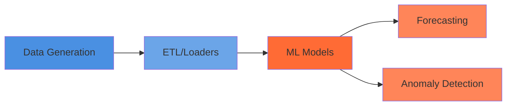

# Getting Started

## The Problem

Cloud infrastructure operates at 12-15% CPU utilization (Alibaba 2018, Google 2011) and 18-25% memory utilization. This gap between provisioned and utilized capacity costs 25-35% of cloud spending—$225.9B wasted in 2024 (Flexera, Gartner).

**hello cloud** applies time series analysis to this problem: forecasting resource needs, detecting anomalies, and modeling utilization patterns. The library implements Gaussian Processes, hierarchical Bayesian models, and foundation model interfaces, grounded in 35+ research papers on actual cloud behavior.

## Quick Start

The fastest way to get started is with our TimeSeries Quickstart tutorial:

**[→ TimeSeries Quickstart Tutorial](../notebooks/06_quickstart_timeseries_loader.ipynb)**

This 15-minute tutorial demonstrates:

- Loading hierarchical time series data with `PiedPiperLoader`
- Filtering, sampling, and aggregating across entity hierarchies
- Computing summary statistics
- Creating publication-quality visualizations

## Installation

### Development Install (Recommended)

```bash
# Install uv
curl -LsSf https://astral.sh/uv/install.sh | sh

# Clone repository
git clone https://github.com/nehalecky/hello-cloud.git
cd hello-cloud

# Install dependencies (editable install)
uv sync --all-extras
```

This installs the project in editable mode with all dependencies: development tools (pytest, ruff), documentation (mkdocs), and optional features.

!!! warning "Apple Silicon Compatibility"
    The `foundation` extra (TimesFM) requires x86_64 architecture. Skip `--all-extras` and use `uv sync --extra dev --extra docs` on Apple Silicon (ARM) machines.

## Next Steps

<div class="grid cards" markdown>

- :material-school: **[Tutorials](../tutorials/index.md)** - Step-by-step guides for common tasks
- :material-flask: **[Research](../research/index.md)** - Empirical foundations and design decisions
- :material-api: **[API Reference](../reference/index.md)** - Complete API documentation
- :material-github: **[GitHub](https://github.com/nehalecky/hello-cloud)** - Source code and issue tracker

</div>

## Architecture Overview



### Module Structure

- **`data_generation/`** - Synthetic data based on empirical patterns
- **`etl/`** - Data loaders (CloudZero, Alibaba trace)
- **`ml_models/`** - Gaussian Processes, hierarchical Bayesian, foundation models
- **`timeseries/`** - Core time series operations and utilities

## Technology Stack

We stand on the shoulders of giants.

| Component | Technology | Purpose |
|-----------|-----------|---------|
| **Data Processing** | [PySpark 4.0](https://spark.apache.org/docs/latest/api/python/) | Distributed DataFrames (local & scale) |
| **Statistical Models** | [GPyTorch](https://gpytorch.ai/) | Gaussian Process time series forecasting |
| **Probabilistic Models** | [PyMC](https://www.pymc.io/) | Bayesian hierarchical inference |
| **Foundation Models** | [Chronos 2](https://github.com/amazon-science/chronos-forecasting), [TimesFM 2.5](https://github.com/google-research/timesfm) | Pre-trained forecasters (optional) |
| **Notebooks** | [Jupyter](https://jupyter.org/) + [MyST](https://myst-parser.readthedocs.io/) | Interactive research workflows |
| **Documentation** | [MkDocs Material](https://squidfunk.github.io/mkdocs-material/) | Live docs with API reference |

## Project Structure

```
hello-cloud/
├── src/hellocloud/         # Source code
│   ├── io/                 # Data loaders (PiedPiperLoader, etc.)
│   ├── timeseries/         # TimeSeries core classes
│   ├── data_generation/    # Synthetic workload patterns
│   ├── ml_models/          # GP, PyMC, foundation models
│   ├── analysis/           # EDA utilities
│   └── transforms/         # PySpark transforms
├── notebooks/              # MyST markdown notebooks
├── docs/                   # MkDocs documentation source
│   ├── notebooks/          # Published .ipynb (executed)
│   ├── research/           # Research reports
│   └── reference/          # API docs (auto-generated)
├── tests/                  # Test suite (92% coverage on GP)
└── examples/published/     # Colab-ready notebooks
```
