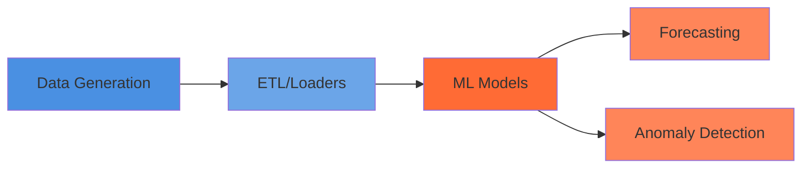

# Getting Started

Welcome to **hello cloud** ☁️ - state-of-the-art time series forecasting for cloud resources, made practical.

## What is hello cloud?

hello cloud is a Python library for modeling cloud resource utilization patterns, forecasting future usage, and detecting anomalies in operational metrics. Built on empirical research showing 25-35% cloud waste and surprisingly low average utilization (12-15% CPU, 18-25% memory).

## Quick Start

The fastest way to get started is with our TimeSeries Quickstart tutorial:

**[→ TimeSeries Quickstart Tutorial](../notebooks/06_quickstart_timeseries_loader.ipynb)**

This 15-minute tutorial demonstrates:

- Loading hierarchical time series data with `PiedPiperLoader`
- Filtering, sampling, and aggregating across entity hierarchies
- Computing summary statistics
- Creating publication-quality visualizations

## Core Capabilities

- **Workload Characterization** - Generate realistic synthetic cloud metrics based on empirical patterns
- **Time Series Forecasting** - Gaussian Processes, ARIMA, and foundation models (Chronos, TimesFM)
- **Anomaly Detection** - Statistical and ML-based approaches for operational monitoring
- **Hierarchical Analysis** - Model relationships across accounts, regions, services
- **Research-Grounded** - All defaults based on published cloud infrastructure research

## Installation

```bash
# Install with uv (recommended)
uv pip install hellocloud

# Or with pip
pip install hellocloud
```

### Optional Dependencies

```bash
# For foundation models (TimesFM) - x86_64 Linux/Intel Mac only
uv pip install hellocloud[foundation]

# For research/development
uv pip install hellocloud[dev,research,docs]
```

!!! warning "Apple Silicon Compatibility"
    The `foundation` extra (TimesFM) is **not compatible** with Apple Silicon (ARM). It requires x86_64 architecture. All other features work on Apple Silicon.

## Next Steps

<div class="grid cards" markdown>

- :material-school: **[Tutorials](../tutorials/index.md)** - Step-by-step guides for common tasks
- :material-flask: **[Research](../research/index.md)** - Empirical foundations and design decisions
- :material-api: **[API Reference](../reference/index.md)** - Complete API documentation
- :material-github: **[GitHub](https://github.com/nehalecky/hello-cloud)** - Source code and issue tracker

</div>

## Architecture Overview



### Module Structure

- **`data_generation/`** - Synthetic data based on empirical patterns
- **`etl/`** - Data loaders (CloudZero, Alibaba trace)
- **`ml_models/`** - Gaussian Processes, hierarchical Bayesian, foundation models
- **`timeseries/`** - Core time series operations and utilities

## Philosophy

hello cloud embraces **research-driven defaults** - all synthetic data generation, model parameters, and anomaly thresholds are grounded in empirical studies of real cloud infrastructure. This means you can trust the defaults while still having full control when needed.

---

Ready to dive in? Start with the **[TimeSeries Quickstart](../notebooks/06_quickstart_timeseries_loader.ipynb)**!
