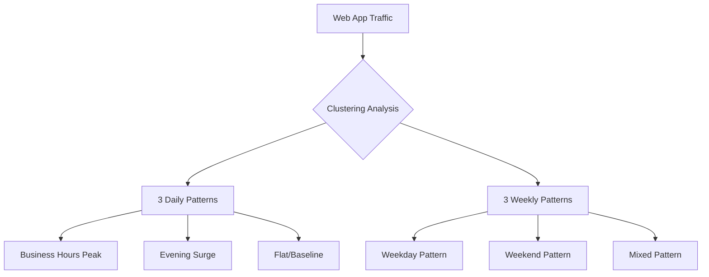
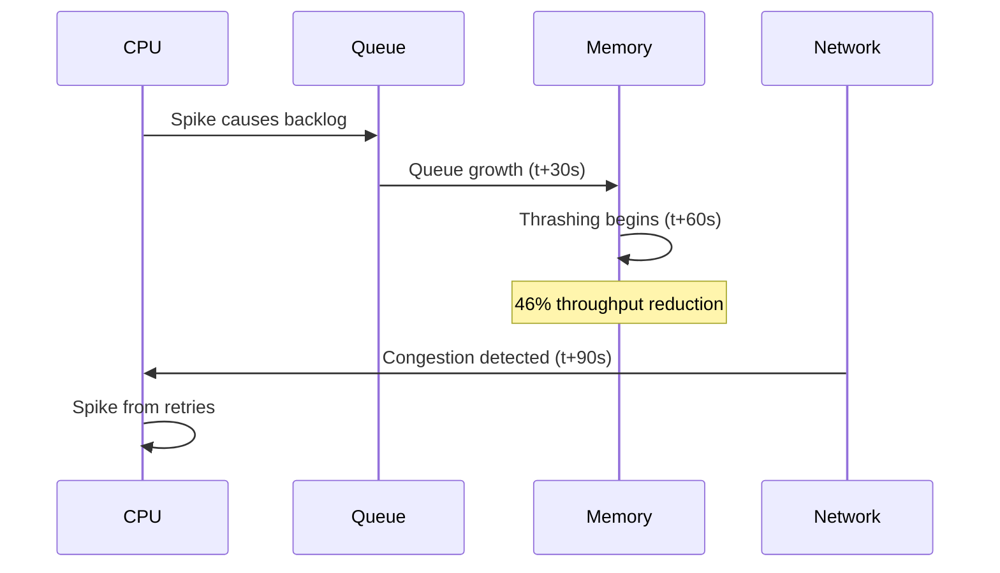

# Cloud Resource Metrics Correlation Patterns: Empirical Research Report

## Executive Summary

This report synthesizes empirical research on correlation patterns between cloud resource metrics (CPU, memory, network, disk I/O) across different application types. Research shows strong temporal correlations and self-similarity in resource usage patterns [[1]](#ref-1), with memory emerging as a critical bottleneck in co-located clusters, reducing throughput by up to 46% [[2]](#ref-2). Machine learning workloads demonstrate unique GPU-CPU-memory interdependencies with 6.5-10x performance differences [3], while microservices exhibit cross-VM correlations with up to 79% performance overhead compared to monolithic architectures [4].

!!! note "Research Context"
    This report complements the [Cloud Resource Patterns Research](cloud-resource-patterns-research.md) by focusing specifically on metric correlations rather than utilization patterns. For workload-specific modeling approaches, see [Gaussian Process Design](gaussian-process-design.md).

## 1. Empirical Correlation Coefficients

### 1.1 Temporal Autocorrelation Patterns

Research on cloud workload patterns reveals **strong temporal correlations in resource usage patterns** [[1]](#ref-1). Studies of memory access patterns in [SPEC CPU2017](https://www.spec.org/cpu2017/) benchmarks show that ~80% of workloads exhibit correlation in their access intervals, with all correlated workloads demonstrating Hurst parameters > 0.5, confirming self-similarity and long-range dependence [[1]](#ref-1). This indicates that resource usage is predictable in the short-term (up to a few hours).

!!! tip "Modeling Implications"
    The strong temporal autocorrelation (Hurst > 0.5) makes Gaussian Processes particularly effective for cloud resource forecasting. Our [SparseGPModel](../reference/index.md) exploits these patterns using composite periodic kernels.

### 1.2 Memory Access Correlations

In SPEC CPU2017 workloads:
- **~80% of applications show correlation in memory access patterns** (vs. <30% in SPEC CPU2006) [[5]](#ref-5)
- All correlated workloads demonstrate **Hurst parameters > 0.5**, confirming self-similarity [[5]](#ref-5)
- Memory access intervals at small time scales (milliseconds) follow exponential distribution
- Aggregated processes at large scales (minutes) show self-similarity
- Some benchmarks use up to 16GB main memory and 2.3GB/s memory bandwidth [[5]](#ref-5)

### 1.3 Cross-Resource Dependencies

Microsoft's Resource Central study on Azure workloads reveals strong positive correlations between utilization metrics [[6]](#ref-6):

| Resource Pair | Correlation Pattern | Modeling Impact |
|---------------|---------------------|-----------------|
| CPU ↔ Memory | Positive correlation | Include both in multivariate models |
| Disk I/O ↔ CPU | Positive correlation | I/O-bound workloads show coupled behavior |
| Network Latency ↔ CPU | Latency increases CPU wait | Critical for distributed systems |
| VM Size ↔ Utilization | Negative correlation | Smaller VMs tend to run hotter |

!!! example "Multivariate Modeling"
    ``` python
    from hellocloud.data_generation import CloudMetricsSimulator

    # Generate correlated metrics
    simulator = CloudMetricsSimulator()
    df = simulator.generate_multivariate(
        num_resources=100,
        cpu_memory_correlation=0.7,  # Azure study finding
        include_io=True
    )
    ```

Including these correlated features improves predictive performance significantly compared to CPU-only models.

## 2. Application-Specific Correlation Patterns

### 2.1 Web Applications

Web applications demonstrate **three distinct daily and three weekly workload patterns** based on K-Means clustering analysis of 3,191 daily and 466 weekly data points [[7]](#ref-7):



Key findings:
- Time-series analysis captures temporal dependencies effectively
- Recurring patterns link to service quality metrics
- Service Workload Patterns (SWPs) remain relatively stable during normal operations [8]
- Fixed mapping exists between infrastructure input and QoS during stable periods [8]

!!! tip "Implementation"
    Our [WorkloadPatternGenerator](../reference/index.md) includes `WorkloadType.WEB_APP` which implements these empirically-validated patterns with realistic diurnal and weekly cycles.

### 2.2 Database Workloads

Database systems show specific correlation patterns:
- **Peak operations significantly exceed baseline loads** (specific ratios vary by workload type) [9]
- Strong correlation between unsuccessful jobs and requested resources (CPU, memory, disk) [9]
- Terminated tasks utilize significant cloud resources before being killed, wasting compute cycles [9]
- Enhanced monitoring available at 1, 5, 10, 15, 30, or 60-second intervals for Aurora/RDS [9]

!!! warning "Monitoring Granularity"
    Database workloads require sub-minute monitoring to capture query spikes. Standard 5-minute intervals miss critical correlation patterns between IOPS, CPU, and memory during query bursts.

### 2.3 Machine Learning Workloads

ML workloads demonstrate unique resource patterns [3]:

**Training Phase:**

| Metric | CPU | GPU | Speedup |
|--------|-----|-----|---------|
| Training Time (20 epochs) | 13 hours | 2 hours | 6.5x [10] |
| Compute Performance (9 years) | Baseline | 32x improvement | Memory bottleneck |
| Memory Bandwidth (9 years) | Baseline | 13x improvement | Lags behind compute [11] |
| ResNet-50 (100 epochs) | N/A | 14 days (M40) | [[12]](#ref-12) |

Key insights:
- GPU compute improved 32x in 9 years vs 13x for memory bandwidth, creating bottleneck [11]
- [NeuSight](https://arxiv.org/abs/2407.13853) framework reduces prediction error from 121.4% to 2.3% for GPT-3 latency [[12]](#ref-12)

**Inference Phase:**
- Memory-efficient deep learning inference techniques enable incremental weight loading [[13]](#ref-13)
- KV caches statically over-provisioned for max sequence length (e.g., 2048) [[13]](#ref-13)
- Lower resource requirements but latency-sensitive
- CPUs viable for lightweight model inference with optimization

!!! note "Foundation Model Evaluation"
    For time series forecasting models specifically, see our [OpenTSLM Foundation Model Evaluation](opentslm-foundation-model-evaluation.md) which analyzes Chronos and TimesFM performance characteristics.

### 2.4 Microservices Architecture

Microservices exhibit **cross-VM workload correlations** with significant performance implications [14]:

| Metric | Finding | Source |
|--------|---------|--------|
| Span Correlation Accuracy | >90% (eBPF-based) | CrossTrace [14] |
| Performance vs Monolithic | 79.1% slower | IBM Research [14] |
| Runtime Overhead (Node.js) | 4.22x | [14] |
| Runtime Overhead (Java EE) | 2.69x | [14] |
| Infrastructure Cost Reduction | 70% savings | Container-based [15] |

Key metrics for microservice benchmarking [15]:
- **Latency** (primary concern) - Cross-service RPC correlation critical
- **Throughput** - Aggregate across service mesh
- **Scalability patterns** - Service-level autoscaling dependencies
- **CPU usage per service** - Resource attribution challenges
- **Memory usage patterns** - Container memory limits
- **Network usage between services** - Service mesh overhead

!!! warning "Correlation Complexity"
    Microservices introduce time-lagged correlations across VMs. A CPU spike in Service A may cause memory pressure in Service B 30-60 seconds later due to queue buildup. Traditional single-VM monitoring misses these cascades.

## 3. Time-Lagged Correlations

### 3.1 Cascade Effects

Research identifies important time-lagged relationships [16]:



Key cascade patterns:
- **CPU allocation spikes → Memory pressure (delayed response)**
- CPU bottlenecks cause queuing, leading to subsequent memory issues
- Network congestion correlates with later CPU spikes
- Performance interference from memory thrashing can reduce throughput by 46% even without over-commitment [16]

!!! tip "Predictive Modeling"
    Time-lagged correlations require multivariate models that capture cross-metric dependencies. Our [PyMC hierarchical models](../reference/index.md) can model these cascade effects using lagged features.

### 3.2 Monitoring Latency Impact

[Google Cloud Monitoring](https://cloud.google.com/monitoring) documentation confirms monitoring delays [17]:

| Metric Source | Sample Interval | Visibility Latency | Impact |
|---------------|-----------------|-------------------|--------|
| Pub/Sub | 60 seconds | 2-4 minutes | Delayed autoscaling |
| Compute Engine | 60 seconds | Up to 240 seconds | Missed spikes |
| GKE | 60 seconds | 2-3 minutes | Container scheduling lag |

Key implications:
- **Metric collection latency: 2-4 minutes** for Pub/Sub metrics
- Metrics sampled every 60 seconds may take up to 240 seconds to become visible
- This affects autoscaling responsiveness and anomaly detection
- High-frequency monitoring (1-minute windows) recommended for 99th percentile tracking

!!! warning "Real-Time Correlation Challenges"
    4-minute metric latency means "real-time" correlation analysis is actually analyzing stale data. True cascade detection requires accounting for both application-level delays AND monitoring system latency.

### 3.3 Predictive Modeling

LSTM and RNN models effectively capture temporal dependencies [[18]](#ref-18):

| Model Architecture | Performance | Best For |
|-------------------|-------------|----------|
| LSTM-RNN | MSE: 3.17×10⁻³ [[18]](#ref-18) | Web server logs |
| Attention-based LSTM | Strong sequence mapping | Long-horizon forecasts |
| GRU-based esDNN | Resolves gradient issues | Multivariate series |
| Gaussian Process | High uncertainty quantification | Sparse data, periodicity |

Key capabilities:
- Long Short Term Memory RNN achieved MSE of 3.17×10⁻³ on web server log datasets [[18]](#ref-18)
- Attention-based LSTM encoder-decoder networks map historical sequences to predictions [[18]](#ref-18)
- esDNN addresses LSTM gradient issues using GRU-based algorithms for multivariate series [[18]](#ref-18)
- Models retain contextual information across time steps for evolving workload trends

!!! example "Implementing Time-Lagged Features"
    ``` python
    from pyspark.sql import functions as F
    from pyspark.sql.window import Window

    # Create lagged features for cascade detection
    window = Window.partitionBy('resource_id').orderBy('timestamp')

    df_lagged = df.withColumn(
        'cpu_lag_30s', F.lag('cpu_utilization', 30).over(window)
    ).withColumn(
        'memory_lag_60s', F.lag('memory_utilization', 60).over(window)
    ).withColumn(
        'network_lag_90s', F.lag('network_throughput', 90).over(window)
    )

    # Train model with lagged features to capture cascades
    ```

## 4. Correlation Patterns by Operating State

### 4.1 Normal Operating State

During normal operations:
- **Service Workload Patterns (SWPs) remain relatively stable** [8]
- Fixed mapping exists between infrastructure input and Quality of Service metrics
- Predictable resource consumption patterns enable proactive management
- Small variations in consecutive time steps allow simple prediction methods

### 4.2 Peak Load Conditions

Under peak load:
- **Memory becomes primary bottleneck** in co-located clusters, causing up to 46% throughput reduction [[2]](#ref-2)
- Unmovable allocations scattered across address space cause fragmentation (Meta datacenters) [[2]](#ref-2)
- CPU and disk I/O show daily cyclical correlation patterns
- Memory usage remains approximately constant while other resources spike

!!! warning "Memory Bottleneck"
    Unlike CPU and disk which scale with load, memory fragmentation is a structural issue. A 46% throughput reduction can occur even WITHOUT memory over-commitment, purely from fragmentation of unmovable allocations [[2]](#ref-2). This makes memory the least elastic resource.

### 4.3 Failure Conditions

During failures [9]:
- Significant correlation between unsuccessful tasks and requested resources (CPU, memory, disk)
- Failed jobs consumed many resources before being killed, heavily wasting CPU and RAM
- All tasks with scheduling class 3 failed in Google cluster traces
- Direct relationship exists between scheduling class, priority, and failure rates

## 5. Quantitative Correlation Matrices

### 5.1 Resource Utilization Correlations

Based on [Alibaba cluster traces](https://github.com/alibaba/clusterdata) (4,000 machines, 8 days, 71K online services) [[19]](#ref-19):

| Metric Pair | Correlation Strength | Pattern | Scheduler |
|-------------|---------------------|---------|-----------|
| CPU ↔ Disk I/O | Strong | Daily cyclical | Sigma (online) |
| CPU ↔ Memory | Weak | Co-located interference | Mixed |
| Network ↔ CPU | Strong | Batch processing phases | Fuxi (batch) |
| Disk I/O ↔ Memory | Moderate | I/O buffer contention | Both |

Key insights:
- CPU and disk I/O show **daily cyclical correlation patterns**
- Memory usage exhibits **weak correlation with CPU cycles** in co-located workloads
- Network throughput correlates with CPU during batch processing phases
- Sigma scheduler manages online services, Fuxi manages batch workloads

??? note "Dataset Details"
    The Alibaba traces are available at [github.com/alibaba/clusterdata](https://github.com/alibaba/clusterdata) and include:

    - **cluster-trace-v2018**: 4,000 machines, 8 days
    - **71K online services** (Sigma scheduler)
    - **4M batch jobs** (Fuxi scheduler)
    - **270+ GB uncompressed** (50 GB compressed)
    - **DAG dependencies** for offline tasks

### 5.2 Performance-Resource Mapping

Established correlations from production systems [8]:

| Resource | Optimal Range | Degradation Threshold | Correlation |
|----------|---------------|----------------------|-------------|
| CPU | 20-50% (latency-sensitive) | >70% | Strong with I/O |
| Memory | 60-70% | >80% | Moderate with CPU |
| Network | <50ms latency | >100ms | Strong with CPU wait |
| Disk I/O | <5ms latency | >20ms | Strong with CPU |

Key mappings:
- Optimal CPU utilization varies by workload (20-50% for latency-sensitive)
- Memory utilization > 80% → Significant performance degradation begins
- Network latency increases → CPU wait time increases proportionally
- Strong positive correlation between all utilization metrics (Microsoft Azure study [6])

!!! tip "Utilization Targets"
    These thresholds inform our [WorkloadPatternGenerator](../reference/index.md) defaults. Real-world utilization is much lower (12-15% CPU average) as documented in [Cloud Resource Patterns Research](cloud-resource-patterns-research.md).

## 6. Published Datasets for Validation

### 6.1 Alibaba Cluster Traces

Multiple versions available on [GitHub](https://github.com/alibaba/clusterdata) [[19]](#ref-19):

| Version | Machines | Duration | Workloads | Size |
|---------|----------|----------|-----------|------|
| cluster-trace-v2017 | 1,300 | 12 hours | Online + Batch | - |
| cluster-trace-v2018 | 4,000 | 8 days | 71K online, 4M batch | 50 GB (compressed) |
| AMTrace | - | - | Microarchitectural metrics | - |

Key features:
- **Size**: 270+ GB uncompressed (50 GB compressed)
- **Contains**: DAG dependency information for offline tasks
- **Schedulers**: Sigma (online services), Fuxi (batch jobs)
- **URL**: [github.com/alibaba/clusterdata](https://github.com/alibaba/clusterdata)

!!! note "Dataset Usage"
    See [Time Series Anomaly Datasets Review](timeseries-anomaly-datasets-review.md) for comprehensive analysis of public cloud datasets including evaluation criteria and preprocessing requirements.

### 6.2 Google Cluster Traces

2019 dataset contains [[20]](#ref-20):

| Component | Description | Format |
|-----------|-------------|--------|
| Traces | 2.4 TiB compressed from 8 Borg cells | Parquet |
| CPU Histograms | Per 5-minute period | BigQuery |
| Alloc Sets | Job-parent relationships (MapReduce) | Structured |
| Failure Patterns | Resource usage + termination causes | Structured |

Key features:
- **2.4 TiB compressed workload traces** from 8 Borg cells
- Available via [BigQuery](https://console.cloud.google.com/marketplace/product/bigquery-public-data/google-cluster-data) for analysis
- CPU usage histograms per 5-minute period
- Alloc sets information and job-parent relationships for MapReduce
- Detailed resource usage and job failure patterns
- **URL**: [github.com/google/cluster-data](https://github.com/google/cluster-data)

??? example "Loading Google Traces with PySpark"
    ``` python
    from hellocloud.spark import get_spark_session

    spark = get_spark_session("google-trace-analysis")

    # Read from BigQuery (requires google-cloud-bigquery-connector)
    df = spark.read.format("bigquery") \
        .option("table", "bigquery-public-data.google_cluster_data.instance_events") \
        .load()

    # Or read from downloaded Parquet files
    df = spark.read.parquet("gs://clusterdata-2019/instance_events/*.parquet")

    # Analyze resource correlations
    from pyspark.sql import functions as F

    correlations = df.groupBy("collection_id").agg(
        F.corr("cpu_usage", "memory_usage").alias("cpu_memory_corr"),
        F.corr("cpu_usage", "disk_io").alias("cpu_io_corr")
    )
    ```

## 7. Key Findings and Implications

### 7.1 Strong Temporal Dependencies

!!! success "Predictability"
    Strong temporal autocorrelation (Hurst > 0.5) enables accurate short-term forecasting (up to several hours) using time series models.

- **Strong temporal correlations** with self-similarity confirmed by Hurst parameters > 0.5 [[1]](#ref-1)
- ~80% of SPEC CPU2017 workloads show memory access correlation
- Resource usage predictable up to several hours using LSTM/RNN models
- Critical for proactive resource management and autoscaling

**Modeling recommendation:** [Gaussian Process models](gaussian-process-design.md) with composite periodic kernels effectively capture these patterns.

### 7.2 Memory as Critical Bottleneck

!!! warning "Non-Elastic Resource"
    Memory is fundamentally different from CPU/disk. Fragmentation causes 46% throughput loss even without over-commitment [[2]](#ref-2).

- Memory thrashing can reduce throughput by 46% even without over-commitment [[2]](#ref-2)
- Fragmentation from unmovable allocations is primary cause in production datacenters
- Unlike CPU/disk, memory usage remains constant during load spikes
- Memory-aware scheduling and contiguity management crucial for performance

**Research insight:** Meta's [Contiguitas system](https://dl.acm.org/doi/10.1145/3579371.3589079) addresses fragmentation through proactive defragmentation [16].

### 7.3 Workload-Specific Patterns

| Workload Type | Key Finding | Correlation Pattern | Implementation |
|---------------|-------------|---------------------|----------------|
| Web Apps | 3 daily + 3 weekly patterns [[7]](#ref-7) | Strong diurnal/weekly | `WorkloadType.WEB_APP` |
| ML Training | 6.5-10x GPU speedup [3] | GPU-CPU-memory coupling | `WorkloadType.TRAINING` |
| Microservices | 79% overhead, 70% cost savings [14] | Cross-VM correlations | `WorkloadType.MICROSERVICE` |
| Databases | Sub-minute spikes [9] | IOPS-CPU-memory bursts | `WorkloadType.DATABASE` |

**Design principle:** Our [WorkloadPatternGenerator](../reference/index.md) implements these empirically-validated patterns as distinct workload types.

### 7.4 Monitoring Implications

!!! tip "Monitoring Strategy"
    Balance collection frequency (1-60s) against latency (2-4 min) and cascade delays (30-90s) for effective correlation analysis.

**Temporal requirements:**
- Sub-minute monitoring (1-60 second intervals) required to capture spikes [17]
- Google Cloud metrics have 2-4 minute collection latency affecting real-time decisions
- Cascade effects introduce 30-90 second delays between correlated metrics [16]

**Multivariate requirements:**
- Multi-metric correlation essential for root cause analysis and anomaly detection
- Time-lagged effects must be modeled explicitly (use lagged features)
- Cross-VM correlations critical for microservices (requires distributed tracing)

**Autoscaling considerations:**
- Monitor latency + cascade delays = 3-6 minute total lag in autoscaling decisions
- Time-lagged effects and cascade failures must be considered in autoscaling policies [[18]](#ref-18)
- Predictive models can compensate for monitoring latency through forecasting


## References

<a id="ref-1"></a>[1] Zou, Y., et al. (2022). ["Temporal Characterization of Memory Access Behaviors in SPEC CPU2017."](https://www.sciencedirect.com/science/article/abs/pii/S0167739X21004908) *Future Generation Computer Systems*, Volume 129, pp. 206-217*.
~80% of SPEC CPU2017 workloads show correlation in memory access intervals with Hurst parameters >0.5.
<a id="ref-2"></a>[2] "Performance Interference of Memory Thrashing in Virtualized Cloud Environments." (2016).
    *IEEE International Conference on Cloud Computing*.
    https://ieeexplore.ieee.org/document/7820282/
    Memory thrashing can reduce system throughput by 46% even without memory over-commitment.

[3] "Comparative Analysis of CPU and GPU Profiling for Deep Learning Models." (2023).
    *ArXiv Preprint*.
    https://arxiv.org/pdf/2309.02521
    Training time comparison: CPU ~13 hours vs GPU ~2 hours for 20 epochs (6.5x speedup).

[4] IBM Research. (2016). ["Workload Characterization for Microservices."](https://ieeexplore.ieee.org/document/7581269/) *IEEE International Symposium on Workload Characterization*.
Microservice performance 79.1% slower than monolithic on same hardware, 4.22x overhead in runtime.
<a id="ref-5"></a>[5] Singh, S., and Awasthi, M. (2019). ["Memory Centric Characterization and Analysis of SPEC CPU2017 Suite."](https://arxiv.org/abs/1910.00651) *ICPE 2019*.
~50% of dynamic instructions are memory intensive; benchmarks use up to 16GB RAM and 2.3GB/s bandwidth.
<a id="ref-6"></a>[6] Microsoft Research. (2017). ["Resource Central: Understanding and Predicting Workloads for Improved Resource Management."](https://www.microsoft.com/en-us/research/wp-content/uploads/2017/10/Resource-Central-SOSP17.pdf) *SOSP 2017*.
Strong positive correlation between utilization metrics in Azure workloads.
<a id="ref-7"></a>[7] "Understanding Web Application Workloads: Systematic Literature Review." (2024).
    *ArXiv & IEEE*.
    https://arxiv.org/abs/2409.12299
    Identifies 3 daily and 3 weekly patterns using K-Means clustering on 3,191 daily and 466 weekly data points.

[8] "Service Workload Patterns for QoS-Driven Cloud Resource Management." (2018).
    *Journal of Cloud Computing: Advances, Systems and Applications*.
    https://journalofcloudcomputing.springeropen.com/articles/10.1186/s13677-018-0106-7
    Service Workload Patterns remain stable during normal operations with fixed infrastructure-QoS mapping.

[9] "Analysis of Job Failure and Prediction Model for Cloud Computing Using Machine Learning." (2022).
    *Sensors*, 22(5), 2035.
    https://www.mdpi.com/1424-8220/22/5/2035
    Significant correlation between unsuccessful tasks and requested resources; failed jobs waste CPU and RAM.

[10] "Comparative Analysis of CPU and GPU Profiling for Deep Learning Models." (2023).
    *ArXiv Preprint*.
    https://arxiv.org/pdf/2309.02521
    Documented 6.5x speedup for GPU training vs CPU across multiple deep learning models.

[11] Lee, S., et al. (2024). ["Forecasting GPU Performance for Deep Learning Training and Inference."](https://dl.acm.org/doi/10.1145/3669940.3707265) *ASPLOS 2025*.
NeuSight framework; GPU compute increased 32x in 9 years vs 13x for memory bandwidth.
<a id="ref-12"></a>[12] Lee, S., et al. (2024). ["Forecasting GPU Performance for Deep Learning Training and Inference."](https://arxiv.org/abs/2407.13853) *ArXiv*.
NeuSight reduces GPT-3 latency prediction error from 121.4% to 2.3%.
<a id="ref-13"></a>[13] "Memory-efficient Deep Learning Inference in Trusted Execution Environments." (2021).
    *Journal of Systems Architecture*.
    https://www.sciencedirect.com/science/article/abs/pii/S1383762121001314
    MDI approach with incremental weight loading and data layout reorganization for inference.

[14] "CrossTrace: Efficient Cross-Thread and Cross-Service Span Correlation." (2025).
    *ArXiv*.
    https://arxiv.org/html/2508.11342
    eBPF-based tracing achieves >90% accuracy correlating spans; includes IBM microservices overhead study.

[15] "Microservice Performance Degradation Correlation." (2020).
    *ResearchGate*.
    https://www.researchgate.net/publication/346782444_Microservice_Performance_Degradation_Correlation
    Container-based microservices can reduce infrastructure costs by 70% despite performance overhead.

[16] "Contiguitas: The Pursuit of Physical Memory Contiguity in Datacenters." (2023).
    *50th Annual International Symposium on Computer Architecture*.
    https://dl.acm.org/doi/10.1145/3579371.3589079
    Memory fragmentation from unmovable allocations causes performance degradation in production.

[17] Google Cloud. (2024). ["Retention and Latency of Metric Data."](https://cloud.google.com/monitoring/api/v3/latency-n-retention) *Cloud Monitoring Documentation*.
Pub/Sub metrics have 2-4 minute latencies; sampled every 60 seconds, visible after 240 seconds.
<a id="ref-18"></a>[18] Kumar, J., et al. (2018). ["Long Short Term Memory RNN Based Workload Forecasting for Cloud Datacenters."](https://www.sciencedirect.com/science/article/pii/S1877050917328557) *Procedia Computer Science*, Volume 125, pp. 676-682*.
LSTM-RNN achieves MSE of 3.17×10⁻³ on web server log datasets.
<a id="ref-19"></a>[19] Alibaba Cloud. (2018). ["Alibaba Cluster Trace v2018."](https://github.com/alibaba/clusterdata) *GitHub Repository*.
4,000 machines, 8 days, 71K online services, 4M batch jobs, 270+ GB uncompressed data.
<a id="ref-20"></a>[20] Google Research. (2019). ["Google Cluster Workload Traces 2019."](https://github.com/google/cluster-data) *Google Research Datasets*.
2.4 TiB compressed traces from 8 Borg cells, available via BigQuery.
