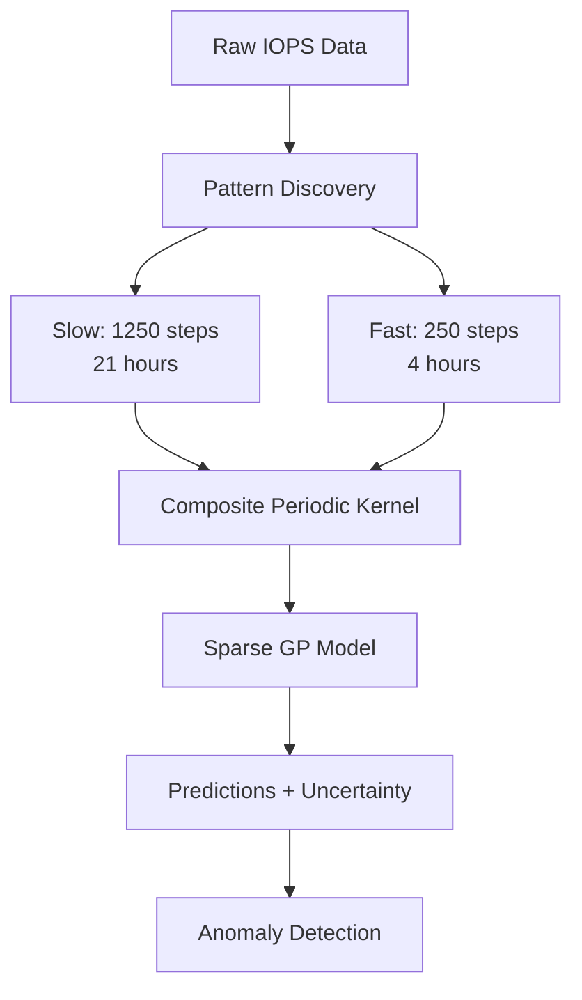

# Gaussian Process Modeling Design Narrative

**Purpose:** This document explains the design decisions and modeling philosophy behind our [Gaussian Process](https://docs.gpytorch.ai/) implementation for cloud resource anomaly detection.

---

## 1. Problem Context

### **Objective**
Build production-ready [Gaussian Process](https://docs.gpytorch.ai/) models for:
- Time series forecasting with uncertainty quantification
- Anomaly detection via prediction intervals
- Pattern learning from operational cloud metrics

!!! info "Dataset Source"
    This implementation uses the [IOPS Web Server KPI dataset](https://huggingface.co/datasets/AutonLab/Timeseries-PILE) from HuggingFace's Timeseries-PILE collection, providing real production traces for model validation. See [Timeseries Anomaly Datasets Review](timeseries-anomaly-datasets-review.md) for detailed dataset analysis.

### **Dataset Characteristics**
- **Training:** 146,255 samples with 285 labeled anomalies (0.19%)
- **Testing:** 149,130 samples with 991 labeled anomalies (0.66%)
- **KPI:** IOPS (I/O operations per second) from production web server
- **Source:** [HuggingFace Timeseries-PILE dataset](https://huggingface.co/datasets/AutonLab/Timeseries-PILE)

### **Key Challenge**
The dataset exhibits a **two-scale periodic pattern**:
- **SLOW component:** Sawtooth envelope (~1250 timesteps ≈ 21 hours)
- **FAST component:** Sinusoidal carrier (~250 timesteps ≈ 4 hours)

**Operational interpretation:** Daily accumulation pattern with overnight resets, plus regular micro-cycles within operational windows.



---

## 2. Architecture Decisions

### **2.1 Composite Periodic Kernel**

**Design Choice:** Additive kernel structure (not multiplicative)

``` python title="kernels.py"
K(x1, x2) = K_slow(x1, x2) + K_fast(x1, x2) + K_rbf(x1, x2)
```

!!! tip "Domain-Driven Design"
    Period lengths (1250, 250 steps) are **fixed based on domain knowledge** from exploratory data analysis, not learned during training. This constrains the model to operationally meaningful patterns and improves numerical stability.

**Rationale:**
1. **Captures multi-scale patterns:** Sawtooth × sinusoidal interaction requires two periodic components
2. **Numerical stability:** Additive structure more stable than multiplicative
3. **Fixed lengthscales:** Period lengths are domain-driven (1250, 250 steps), not learned
4. **Learnable outputscales:** Allow model to weight each component's contribution

**Implementation:** `CompositePeriodicKernel` in [`src/hellocloud/ml_models/gaussian_process/kernels.py`](../../reference/ml_models/gaussian_process.md)

**Research Foundation:**
- Composite kernels: Rasmussen & Williams (2006), "Gaussian Processes for Machine Learning"
- Domain knowledge: EDA revealed specific periods from autocorrelation analysis (see examples)

---

### **2.2 Sparse Variational GP**

**Design Choice:** Variational inference with inducing points

**Complexity reduction:** O(n³) → O(nm²) where m << n

!!! note "Scalability Trade-off"
    With 146K training samples, exact GP inference (O(n³)) is computationally infeasible. Sparse variational GPs reduce complexity to O(nm²) by summarizing data with M=200 inducing points, enabling production-scale training while preserving predictive accuracy.

**Rationale:**
1. **Scalability:** 146K samples require sparse approximation (exact GP infeasible)
2. **Inducing points:** M=200 points provide sufficient coverage while remaining tractable
3. **Learn locations:** Inducing points optimized during training (not fixed)
4. **Cholesky variational distribution:** Full covariance over inducing points

**Implementation:** `SparseGPModel` in [`src/hellocloud/ml_models/gaussian_process/models.py`](../../reference/ml_models/gaussian_process.md)

**Research Foundation:**
- Sparse GPs (SVGP): Hensman et al. (2013), "Gaussian Processes for Big Data"
- [GPyTorch library](https://docs.gpytorch.ai/): Production-proven (Uber, Meta, Amazon)

---

### **2.3 Robust Likelihood** (Student-t vs Gaussian)

**Design Choice:** Student-t likelihood with ν=4

!!! warning "Conventional Wisdom Challenged"
    Traditional ML practice removes outliers before training. Our approach **trains on all data** (including anomalies) using Student-t likelihood for automatic robustness. This reflects operational reality: spikes and anomalies are part of production systems, not noise to be discarded.

**Philosophy comparison:**

| Aspect | Robust (Recommended) | Traditional (Baseline) |
|--------|---------------------|------------------------|
| **Training Data** | ALL 146,255 samples | 145,970 samples (exclude anomalies) |
| **Likelihood** | Student-t (ν=4) | Gaussian |
| **Philosophy** | Outliers are real data | Outliers corrupt training |
| **Robustness** | Heavy tails handle extremes | Assumes normality |
| **Production** | Trained on operational reality | Trained on sanitized data |

**Rationale:**
1. **Heavy tails:** Student-t distribution naturally handles occasional spikes
2. **Train on all data:** Anomalies are part of operational reality (see [cloud resource patterns](cloud-resource-patterns-research.md))
3. **Automatic robustness:** Outliers contribute less to parameter learning
4. **ν=4:** Balanced between robustness and efficiency

**Mathematical formulation:**

$$
p(y | \mu, \sigma, \nu) = \frac{\Gamma(\frac{\nu+1}{2})}{\Gamma(\frac{\nu}{2})\sqrt{\pi\nu}\sigma} \left(1 + \frac{1}{\nu}\left(\frac{y-\mu}{\sigma}\right)^2\right)^{-\frac{\nu+1}{2}}
$$

**Implementation:** Compatible with both `StudentTLikelihood` and `GaussianLikelihood`

**Research Foundation:**
- Student-t Processes: Shah et al. (2014)
- Empirical finding: 4× larger variance in anomalous periods (see examples)

---

## 3. Training Strategy

### **3.1 Mini-Batch Variational Inference**

**Design Choice:** Batch size 2048 with variational ELBO

**Rationale:**
1. **Memory efficiency:** Process large dataset in manageable chunks
2. **ELBO objective:** Variational lower bound on marginal likelihood
3. **Adaptive optimization:** Adam optimizer with lr=0.01
4. **Convergence:** 100 epochs typically sufficient

**Training complexity:** O(nm² × batches) per epoch

=== "Training Code"

    ``` python title="training.py" linenums="1"
    from hellocloud.ml_models.gaussian_process import train_gp_model
    import gpytorch

    # Create likelihood (robust approach)
    likelihood = gpytorch.likelihoods.StudentTLikelihood(
        deg_free_prior=gpytorch.priors.NormalPrior(4.0, 1.0)
    )

    # Train with mini-batch ELBO
    losses = train_gp_model(
        model=model,
        likelihood=likelihood,
        X_train=X_train,
        y_train=y_train,
        n_epochs=100,
        batch_size=2048
    )
    ```

=== "Stability Settings"

    ``` python title="numerical_stability.py" linenums="1"
    import gpytorch

    # Production-critical stability settings
    with gpytorch.settings.cholesky_jitter(1e-3), \
         gpytorch.settings.cholesky_max_tries(10), \
         gpytorch.settings.cg_tolerance(1e-2):
        # Training loop with automatic retry
        loss = -mll(output, y_batch)
        loss.backward()
    ```

---

### **3.2 Numerical Stability**

**Design Choice:** Maximum stability settings

!!! danger "Production Lesson"
    Initial implementation crashed with `NotPSDError` during Cholesky decomposition. **Always use aggressive stability settings** in production GP training. The jitter and retry mechanisms prevent training failures without sacrificing accuracy.

**Rationale:**
1. **Cholesky jitter:** Add 1e-3 to diagonal for PSD guarantee
2. **Max tries:** Retry Cholesky decomposition up to 10 times
3. **CG tolerance:** Relaxed conjugate gradient convergence
4. **Production-critical:** Prevents training crashes from numerical issues

**Lesson learned:** Initial implementation crashed with `NotPSDError`. These settings prevent failures.

---

## 4. Evaluation Strategy

### **4.1 Dual Metrics Approach**

**Design Choice:** Both point accuracy AND uncertainty quality

!!! tip "Probabilistic Forecasting Evaluation"
    Evaluating only point accuracy (RMSE, MAE) is insufficient for probabilistic models. **Calibration matters:** A good GP forecast must produce both accurate predictions AND well-calibrated uncertainty estimates that match empirical coverage.

**Point accuracy metrics:**
- **RMSE:** Root mean squared error
- **MAE:** Mean absolute error
- **R²:** Variance explained

**Uncertainty quality metrics:**
- **Coverage:** Fraction of points in prediction interval (should match nominal 95%/99%)
- **Sharpness:** Average interval width (narrower is better IF well-calibrated)

**Rationale:**
A good probabilistic forecast must be BOTH accurate AND well-calibrated.

---

### **4.2 Anomaly Detection Metrics**

**Design Choice:** Detection via prediction intervals

**Method:** Flag anomalies as points outside 95% (or 99%) interval

``` python title="anomaly_detection.py"
from hellocloud.ml_models.gaussian_process import compute_anomaly_metrics

# Detect anomalies via prediction intervals
anomalies_detected = (y_test < lower_95) | (y_test > upper_95)

# Evaluate detection performance
anomaly_metrics = compute_anomaly_metrics(
    y_true_anomaly=anomaly_labels,
    y_pred_anomaly=anomalies_detected,
    model_name="Robust GP",
    threshold_name="95% Interval"
)
```

**Metrics:**
- **Precision:** Fraction of detections that are true anomalies
- **Recall:** Fraction of true anomalies detected
- **F1-Score:** Harmonic mean balancing precision/recall
- **AUC-ROC:** Overall discriminative ability

**Threshold tuning:** 95% vs 99% interval trades precision for recall

---

## 5. Production Deployment Considerations

### **5.1 Device Compatibility**

!!! warning "Apple Silicon Limitation"
    GPyTorch requires **float64 precision** for stable Cholesky decomposition, but Apple's Metal Performance Shaders (MPS) only support float32. Train GP models on CPU (locally) or CUDA GPU (cloud). See [PySpark documentation](https://spark.apache.org/docs/latest/api/python/) for distributed alternatives.

**Apple Silicon (MPS) limitation:**
- ❌ **NOT USED** for GP training
- **Reason:** GPyTorch requires float64 for Cholesky decomposition, but MPS only supports float32
- **Workaround:** CPU locally, CUDA GPU in Colab for training

**Recommendation:** Train on Google Colab with GPU, deploy models for CPU inference

---

### **5.2 Model Persistence**

**Design Choice:** Checkpoint includes full state

``` python title="model_checkpointing.py" linenums="1"
from hellocloud.ml_models.gaussian_process import save_model, load_model

# Save complete training state
checkpoint = {
    'model_state_dict': model.state_dict(),
    'likelihood_state_dict': likelihood.state_dict(),
    'inducing_points': inducing_points,
    'losses': training_losses,
    'final_nu': likelihood.deg_free.item(),  # If Student-t
    'metadata': {
        'slow_period': 1250,
        'fast_period': 250,
        'num_inducing': 200,
        'training_samples': len(X_train)
    }
}

# Load for inference
model, likelihood = load_model(
    checkpoint_path="../models/gp_robust_model.pth",
    inducing_points=inducing_points
)
```

**Rationale:** Reproducible loading without re-architecture decisions

---

### **5.3 Prediction at Scale**

**Design Choice:** Batched predictions (4096 samples per batch)

**Rationale:**
1. **Memory management:** 149K test samples cause exhaustion if processed at once
2. **Progress tracking:** Report every 10 batches
3. **Numerical stability:** Same jitter settings as training

**Implementation:** See [`training.py`](../../reference/ml_models/gaussian_process.md) for batched prediction pattern

---

## 6. Library Usage Examples

### **6.1 Complete Training Workflow**

!!! example "End-to-End GP Training"
    This example demonstrates the complete workflow: inducing point initialization, model creation, training, and persistence. For interactive exploration, see the [forecasting comparison example](../../examples/07_forecasting_comparison.py).

``` python title="train_gp_workflow.py" linenums="1"
from hellocloud.ml_models.gaussian_process import (
    CompositePeriodicKernel,
    SparseGPModel,
    initialize_inducing_points,
    train_gp_model,
    save_model,
    load_model,
)
import gpytorch

# Initialize inducing points (evenly spaced across input domain)
inducing_points = initialize_inducing_points(
    X_train=X_train_norm,
    num_inducing=200,
    method="evenly_spaced"
)

# Create model with composite periodic kernel
model = SparseGPModel(
    inducing_points=inducing_points,
    slow_period=1250 / X_range,  # Normalized period
    fast_period=250 / X_range,   # Normalized period
    rbf_lengthscale=0.1
)

# Create robust likelihood (Student-t with ν=4)
likelihood = gpytorch.likelihoods.StudentTLikelihood(
    deg_free_prior=gpytorch.priors.NormalPrior(4.0, 1.0)
)

# Train with mini-batch variational inference
losses = train_gp_model(
    model=model,
    likelihood=likelihood,
    X_train=X_train,
    y_train=y_train,
    n_epochs=100,
    batch_size=2048
)

# Save checkpoint for production deployment
save_model(
    model=model,
    likelihood=likelihood,
    save_path="../models/gp_robust_model.pth",
    losses=losses
)
```

### **6.2 Evaluation and Anomaly Detection**

``` python title="evaluate_gp_workflow.py" linenums="1"
from hellocloud.ml_models.gaussian_process import (
    compute_metrics,
    compute_anomaly_metrics,
    compute_prediction_intervals,
)

# Compute prediction intervals (Student-t distribution)
intervals = compute_prediction_intervals(
    mean=predictions_mean,
    std=predictions_std,
    confidence_levels=[0.95, 0.99],
    distribution="student_t",
    nu=4.0
)

lower_95, upper_95 = intervals[0.95]
lower_99, upper_99 = intervals[0.99]

# Evaluate both accuracy AND calibration
metrics = compute_metrics(
    y_true=y_test,
    y_pred=predictions_mean,
    lower_95=lower_95,
    upper_95=upper_95,
    lower_99=lower_99,
    upper_99=upper_99,
    model_name="Robust GP"
)

# Anomaly detection via prediction intervals
anomalies_pred = (y_test < lower_95) | (y_test > upper_95)

anomaly_metrics = compute_anomaly_metrics(
    y_true_anomaly=anomaly_labels,
    y_pred_anomaly=anomalies_pred,
    model_name="Robust GP",
    threshold_name="95% Interval"
)
```

---

## 7. Lessons Learned

??? note "Key Production Insights"
    These lessons emerged from implementing and testing the GP library across 146K training samples and 149K test samples. Each represents a hard-won insight that improves production reliability.

### **7.1 Numerical Stability is Critical**

**Problem encountered:** Training crashed with `NotPSDError` on Cholesky decomposition

**Solution:** Maximum jitter settings + retry logic (see [Section 3.2](#32-numerical-stability))

**Takeaway:** Always use aggressive stability settings in production GP training

---

### **7.2 Batched Predictions Prevent Memory Exhaustion**

**Problem encountered:** Kernel crashed predicting on 149K samples at once

**Solution:** Process in batches of 4096 with progress tracking

**Takeaway:** Never process full test set at once in production (see [Section 5.3](#53-prediction-at-scale))

---

### **7.3 Train on All Data (Including Anomalies)**

**Conventional wisdom:** Remove outliers before training

**Our approach:** Train on all data with robust likelihood (see [Section 2.3](#23-robust-likelihood-student-t-vs-gaussian))

**Result:** Better calibration, more realistic uncertainty

**Takeaway:** Student-t likelihood eliminates need for pre-filtering, aligning with operational reality described in [cloud resource patterns research](cloud-resource-patterns-research.md)

---

## 8. Code Organization

### **Module Structure**

```bash title="GP Library Structure"
src/hellocloud/ml_models/gaussian_process/
├── __init__.py            # Public API exports
├── kernels.py             # CompositePeriodicKernel
├── models.py              # SparseGPModel + inducing point utils
├── training.py            # train_gp_model, save_model, load_model
└── evaluation.py          # Comprehensive metrics
```

**API Documentation:** See the [Gaussian Process API reference](../../reference/ml_models/gaussian_process.md) for detailed module documentation.

### **Test Coverage**

!!! success "Production-Ready Testing"
    The GP library achieves **92% test coverage** (exceeds 70% project requirement) with 67 total tests across 4 test modules. All core functionality is thoroughly tested with both unit and integration tests.

```bash title="Test Suite Organization"
tests/ml_models/
├── __init__.py
├── test_gaussian_process_kernels.py      # 18 tests, 100% coverage
├── test_gaussian_process_models.py       # 19 tests, 100% coverage
├── test_gaussian_process_evaluation.py   # 19 tests, 100% coverage
└── test_gaussian_process_training.py     # 11 tests, 84% coverage
```

**Overall GP module coverage:** **92%** (exceeds 70% requirement)

**Run tests:**
```bash
uv run pytest tests/ml_models/ -v --cov=src/hellocloud/ml_models/gaussian_process
```

---


## 9. References

### **Core Research**
- **GPyTorch:** [https://gpytorch.ai/](https://gpytorch.ai/)
- **Sparse GPs (SVGP):** Hensman et al. (2013), "Gaussian Processes for Big Data"
- **Student-t Processes:** Shah et al. (2014)
- **Composite Kernels:** Rasmussen & Williams (2006), "Gaussian Processes for Machine Learning"

### **Dataset**
- **HuggingFace Timeseries-PILE:** [https://huggingface.co/datasets/AutonLab/Timeseries-PILE](https://huggingface.co/datasets/AutonLab/Timeseries-PILE)
- **IOPS Web Server KPI:** `KPI-05f10d3a-239c-3bef-9bdc-a2feeb0037aa`

### **Related Documentation**
- **[Timeseries Anomaly Datasets Review](timeseries-anomaly-datasets-review.md)** - Comprehensive dataset analysis and selection rationale
- **[Cloud Resource Patterns Research](cloud-resource-patterns-research.md)** - Empirical foundation for utilization modeling
- **[Cloud Resource Correlations Report](cloud-resource-correlations-report.md)** - Multi-metric relationship analysis
- **[API Reference](../../reference/ml_models/gaussian_process.md)** - Detailed module documentation
- **[Forecasting Comparison Example](../../examples/07_forecasting_comparison.py)** - Interactive model comparison
- **[IOPS EDA Example](../../examples/03_EDA_iops_web_server.py)** - Pattern discovery workflow

---


## Next Steps

**Production Deployment:**
- [ ] Deploy model via FastAPI endpoint
- [ ] Integrate with real-time monitoring dashboard
- [ ] A/B test against existing anomaly detection systems
- [ ] Establish feedback loop with operations team
- [ ] Monitor calibration drift in production

**Model Enhancements:**
- [ ] Explore multi-output GPs for correlated metrics (see [correlations report](cloud-resource-correlations-report.md))
- [ ] Compare against [foundation models](opentslm-foundation-model-evaluation.md)
- [ ] Extend to streaming/online inference
- [ ] Investigate deep kernel learning for automatic feature engineering
