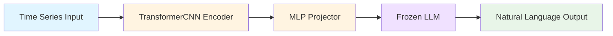

# OpenTSLM Foundation Model Evaluation

**Evaluation Date:** October 2, 2025
**Evaluator:** Research Team
**Status:** ❌ Not Recommended for Cloud Anomaly Detection

---

## Executive Summary

[OpenTSLM](https://www.opentslm.com) is a Stanford-developed timeseries foundation model that processes multivariate time series through language model reasoning. While architecturally innovative, **it is not suitable for cloud resource anomaly detection** due to:

1. **❌ No Pre-trained Weights** - Requires training from scratch (5-stage curriculum, days/weeks with GPU)
2. **❌ Medical Domain Focus** - Optimized for ECG, EEG, and human activity recognition, not cloud metrics
3. **❌ High Training Overhead** - ~6GB dataset downloads, CUDA GPU required, HuggingFace authentication needed
4. **❌ Not Designed for Anomaly Detection** - Focused on Q&A, captioning, and chain-of-thought reasoning

!!! warning "Not Recommended for Cloud Anomaly Detection"
    After comprehensive evaluation, we do not recommend OpenTSLM for cloud resource monitoring. The model's medical domain specialization and lack of pre-trained weights make it impractical for our use case. See [Timeseries Anomaly Datasets Review](timeseries-anomaly-datasets-review.md) for alternative approaches.

**Recommendation:** Explore purpose-built anomaly detection models or cloud-metric-trained foundation models instead.

---

## Research Context

### Motivation
While reviewing HackerNews on October 2, 2025, we discovered OpenTSLM - a newly published timeseries foundation model from Stanford. Given our project's need for anomaly detection capabilities in [cloud resource monitoring](cloud-resource-patterns-research.md), we investigated whether OpenTSLM could serve as a foundation model for:

1. **Timeseries Anomaly Detection** in cloud resource utilization
2. **Pattern Recognition** across multivariate cloud metrics (CPU, memory, network, disk)
3. **Natural Language Explanations** for detected anomalies

!!! info "Our Baseline Models"
    We've already implemented [Gaussian Process models](gaussian-process-design.md) for probabilistic forecasting. This evaluation explores whether OpenTSLM could complement or replace these approaches with foundation model capabilities.

### Research Question
**Can OpenTSLM be adapted or fine-tuned for cloud resource anomaly detection in the cloud-resource-simulator project?**

---

## Investigation Methodology

### Phase 1: Repository Analysis
1. **Forked Repository** to personal GitHub account: [nehalecky/OpenTSLM](https://github.com/nehalecky/OpenTSLM)
2. **Cloned Locally** to `/Users/nehalecky/Projects/cloudzero/OpenTSLM`
3. **Initialized Submodules** (open_flamingo dependency)
4. **Examined Documentation** - README, code structure, training pipeline

### Phase 2: Model Weights Investigation
- Searched for pre-trained checkpoints in repository
- Checked HuggingFace for published models
- Reviewed training scripts for weight download mechanisms
- Analyzed `curriculum_learning.py` for checkpoint handling

### Phase 3: Architecture & Requirements Analysis
- Reviewed model implementations (`OpenTSLMFlamingo`, `OpenTSLMSP`)
- Examined encoder architecture (`TransformerCNN`)
- Analyzed training datasets and their domains
- Assessed infrastructure requirements

---

## Key Findings

### Critical Limitation: No Pre-trained Weights Available

!!! danger "Show-Stopper: Training Required from Scratch"
    **OpenTSLM does NOT provide pre-trained model weights.** Unlike [Amazon Chronos](https://github.com/amazon-science/chronos-forecasting) or [Google TimesFM](https://github.com/google-research/timesfm), which offer ready-to-use checkpoints, OpenTSLM requires training from scratch using a full 5-stage curriculum that takes days to weeks on GPU hardware.

**What's Available:**
- Base LLM models from HuggingFace (Llama 3.2-1B, Gemma-3-270m)
- These are **untrained base models**, not OpenTSLM-trained weights
- No shortcuts or intermediate checkpoints provided

**What's Required:**

```bash title="OpenTSLM Training Pipeline" linenums="1"
# 1. Obtain base LLM (requires HuggingFace authentication)
huggingface-cli login

# 2. Run full 5-stage curriculum training
python curriculum_learning.py --model OpenTSLMFlamingo

# Stages:
# - Stage 1: Multiple Choice Q&A (TSQA dataset)
# - Stage 2: Time Series Captioning (M4 dataset)
# - Stage 3: HAR Chain-of-Thought (~download required)
# - Stage 4: Sleep Staging CoT (EEG data)
# - Stage 5: ECG Q&A CoT (~6GB download)

# Training time: Days to weeks depending on GPU
```

!!! tip "Checkpoint Structure"
    If you do train OpenTSLM, checkpoints are saved per stage:

    ```
    results/
    └── Llama3_2_1B/
        └── OpenTSLMFlamingo/
            ├── stage1_mcq/checkpoints/best_model.pt
            ├── stage2_captioning/checkpoints/best_model.pt
            ├── stage3_cot/checkpoints/best_model.pt
            ├── stage4_sleep_cot/checkpoints/best_model.pt
            └── stage5_ecg_cot/checkpoints/best_model.pt
    ```

---

### Domain Mismatch: Medical Focus

!!! note "Medical vs. Cloud Infrastructure"
    OpenTSLM is purpose-built for medical time series with fundamentally different characteristics than cloud metrics. Our research in [cloud resource patterns](cloud-resource-patterns-research.md) shows CPU utilization averaging 12-15% with temporal autocorrelation of 0.7-0.8, while medical signals exhibit high-frequency physiological rhythms.

**Primary Use Cases:**
- **ECG Analysis** - 12-lead electrocardiogram interpretation
- **Sleep Staging** - EEG-based sleep classification
- **Human Activity Recognition** - Accelerometer/gyroscope data
- **Medical Time Series Q&A** - Clinical reasoning tasks

**Training Datasets:**
| Stage | Dataset | Domain | Size |
|-------|---------|--------|------|
| 1 | TSQA | Time Series Q&A | Auto-download |
| 2 | M4 | General forecasting | Auto-download |
| 3 | HAR | Human activity | ~Download |
| 4 | SleepEDF | EEG sleep staging | Auto-download |
| 5 | ECG-QA + PTB-XL | 12-lead ECG | ~6GB |

**Domain Characteristics Comparison:**

=== "Medical Time Series"

    - High sampling rates (100-500 Hz for medical signals)
    - Strong physiological constraints (QRS complexes, sleep stages)
    - Clinical terminology and reasoning patterns
    - Diagnostic question-answering focus

=== "Cloud Infrastructure Metrics"

    - Low sampling rates (1-5 minute intervals typical)
    - Different correlation patterns (resource contention, not physiology)
    - Infrastructure terminology (pods, nodes, services)
    - Anomaly detection focus (not diagnostic Q&A)

**Conclusion:** Significant domain gap between medical time series and cloud infrastructure metrics.

---

### Architecture Analysis

#### Model Components

**1. OpenTSLMFlamingo Architecture**



**Components:**
- **Encoder:** `TransformerCNN` - Processes multivariate time series of any length
- **Projector:** MLP layers align time series embeddings with LLM embedding space
- **LLM:** Pre-trained language model (Llama 3.2-1B or Gemma variants)
- **Training:** LoRA fine-tuning with parameter-efficient adaptation

**2. Alternative: OpenTSLMSP**
- Uses special tokens instead of Flamingo architecture
- Same encoder/projector concept
- Different integration with base LLM

!!! tip "Architectural Innovation"
    OpenTSLM's key innovation is combining time series understanding with natural language reasoning, enabling chain-of-thought explanations for predictions. This contrasts with our [Gaussian Process approach](gaussian-process-design.md), which provides probabilistic uncertainty estimates but not natural language explanations.

---

### Training Requirements

#### Hardware Requirements

!!! warning "GPU Required for Training"
    OpenTSLM training requires significant compute resources:

    - **Preferred:** CUDA-enabled NVIDIA GPU (days of training time)
    - **Alternative:** Apple Silicon MPS (with compatibility warnings)
    - **Critical:** Models trained on CUDA may not transfer to MPS

#### Software Dependencies

```python title="requirements.txt (excerpt)"
# Core ML/DL (from requirements.txt)
torch
transformers
peft  # LoRA fine-tuning
huggingface-hub

# Time Series
chronos-forecasting  # (1)!
wfdb  # ECG signal processing

# Vision/Multimodal
open-clip-torch
einops

# Data Processing
numpy, pandas
scikit-learn
matplotlib
```

1. Interestingly, OpenTSLM depends on Chronos for time series processing. Since we already have [Chronos integrated](../reference/index.md#ml_models.foundation.chronos), we're better off using it directly.

#### Training Pipeline (5 Stages)

=== "Stage 1: Multiple Choice Questions (~hours)"

    ```bash
    python curriculum_learning.py --model OpenTSLMFlamingo --stages stage1_mcq
    ```
    - Dataset: TSQA (Time Series Question Answering)
    - Task: Answer multiple choice questions about time series patterns
    - Auto-downloads from HuggingFace

=== "Stage 2: Captioning (~hours)"

    ```bash
    python curriculum_learning.py --model OpenTSLMFlamingo --stages stage2_captioning
    ```
    - Dataset: M4 competition data
    - Task: Generate natural language descriptions of time series
    - Focuses on pattern recognition and verbalization

=== "Stage 3: HAR Chain-of-Thought (~hours-days)"

    ```bash
    python curriculum_learning.py --model OpenTSLMFlamingo --stages stage3_cot
    ```
    - Dataset: Human Activity Recognition (HAR)
    - Download: https://polybox.ethz.ch/index.php/s/kD74GnMYxn3HBEM/download
    - Task: Classify activities with reasoning steps

=== "Stage 4: Sleep Staging CoT (~hours-days)"

    ```bash
    python curriculum_learning.py --model OpenTSLMFlamingo --stages stage4_sleep_cot
    ```
    - Dataset: SleepEDF (EEG data)
    - Task: Sleep stage classification with chain-of-thought
    - Medical domain specialization begins

=== "Stage 5: ECG Q&A CoT (~days)"

    ```bash
    python curriculum_learning.py --model OpenTSLMFlamingo --stages stage5_ecg_cot
    ```
    - Datasets: ECG-QA + PTB-XL (~6GB combined)
    - Download: https://polybox.ethz.ch/index.php/s/D5QaJSEw4dXkzXm/download
    - Task: 12-lead ECG clinical reasoning
    - Most medically specialized stage

**Full Curriculum:**

```bash title="Complete Training Pipeline"
python curriculum_learning.py --model OpenTSLMFlamingo
# Estimated time: Days to weeks depending on GPU
```

---

## Applicability Assessment for Cloud Resource Simulator

### Alignment Analysis

!!! note "Evaluation Criteria"
    We evaluate OpenTSLM against requirements derived from our [cloud resource patterns research](cloud-resource-patterns-research.md) and existing [Gaussian Process implementation](gaussian-process-design.md).

| Requirement | OpenTSLM Support | Assessment |
|-------------|------------------|------------|
| **Anomaly Detection** | ❌ Not primary focus | Q&A/captioning oriented, not outlier detection |
| **Cloud Metrics** | ❌ Medical training data | Domain mismatch (ECG/EEG vs CPU/memory) |
| **Pre-trained Model** | ❌ Must train from scratch | Prohibitive for exploration phase |
| **Fast Inference** | ⚠️ Depends on LLM size | Llama 3.2-1B moderate, Gemma-270m faster |
| **Multivariate Support** | ✅ Native support | Handles multiple metrics simultaneously |
| **Variable Length** | ✅ Any length | Good for different time windows |
| **Explainability** | ✅ Chain-of-thought | Natural language reasoning available |

### Strengths for Cloud Use Case
✅ **Multivariate Time Series** - Can process CPU, memory, network, disk together
✅ **Variable Length Sequences** - Handles different monitoring windows
✅ **Natural Language Output** - Could explain anomalies in plain English
✅ **Modular Architecture** - Encoder/projector/LLM separation allows adaptation

### Critical Limitations for Cloud Use Case
❌ **No Pre-trained Weights** - Cannot evaluate without weeks of training
❌ **Medical Domain Bias** - Training data fundamentally different from cloud metrics
❌ **Not Anomaly-Focused** - Designed for Q&A, not outlier/anomaly detection
❌ **Training Overhead** - Requires substantial GPU resources and time
❌ **Dataset Mismatch** - No cloud infrastructure training data included

### Alternative Approaches Recommended

!!! success "Better Alternatives for Cloud Anomaly Detection"
    Instead of training OpenTSLM from scratch, we recommend focusing on:

    1. **Enhancing our existing [Gaussian Process models](gaussian-process-design.md)** for probabilistic forecasting
    2. **Leveraging pre-trained foundation models** like [Chronos](https://github.com/amazon-science/chronos-forecasting) (already integrated)
    3. **Exploring purpose-built anomaly detection** from our [datasets review](timeseries-anomaly-datasets-review.md)

**For Anomaly Detection:**

=== "Traditional ML Models"

    - Isolation Forest (scikit-learn)
    - LSTM Autoencoders (reconstruction error)
    - Prophet (Facebook) for seasonal decomposition

=== "Purpose-Built Time Series Models"

    - [Amazon Chronos](https://github.com/amazon-science/chronos-forecasting) - Already integrated in our project
    - [Google TimesFM](https://github.com/google-research/timesfm) - Zero-shot forecasting
    - Both have pre-trained weights and better domain fit

=== "Cloud-Specific Models"

    - AWS DeepAR (if using AWS data)
    - Azure Anomaly Detector (if using Azure data)
    - GCP Time Series Insights (if using GCP data)

**For Explainability:**
- SHAP values on anomaly detection models
- Attention weights from transformer-based detectors
- Rule-based explanations from traditional methods

---

## Repository Information

### Forked Repository
- **GitHub:** https://github.com/nehalecky/OpenTSLM
- **Upstream:** https://github.com/StanfordBDHG/OpenTSLM
- **Local Path:** `/Users/nehalecky/Projects/cloudzero/OpenTSLM`
- **Stars:** 73 (as of Oct 2, 2025)
- **Created:** May 2025
- **Last Updated:** October 1, 2025

### Repository Structure
```
OpenTSLM/
├── curriculum_learning.py          # Main training script
├── requirements.txt                # 21 dependencies
├── src/
│   ├── model/
│   │   ├── encoder/               # TransformerCNN
│   │   ├── llm/                   # OpenTSLMFlamingo, OpenTSLMSP
│   │   └── projector/             # MLP alignment
│   ├── time_series_datasets/      # Dataset loaders (TSQA, M4, HAR, Sleep, ECG)
│   ├── prompt/                    # Prompt templates
│   └── open_flamingo/            # Submodule
├── evaluation/                    # Evaluation scripts
├── test/                         # Unit tests
└── data/                         # Auto-downloaded datasets
```

### Additional Resources
- **Paper:** https://doi.org/10.13140/RG.2.2.14827.60963
- **Website:** https://www.opentslm.com
- **Related Papers:**
  - [ECG-QA](https://arxiv.org/abs/2306.15681)
  - [PTB-XL Dataset](https://www.nature.com/articles/s41597-020-0495-6)

---

## Decision & Next Steps

### Decision: Not Pursuing OpenTSLM

**Primary Reasons:**
1. **Training Barrier** - No pre-trained weights; requires weeks of GPU time
2. **Domain Mismatch** - Medical focus doesn't transfer well to cloud infrastructure
3. **Wrong Task Focus** - Designed for Q&A/captioning, not anomaly detection
4. **Better Alternatives Exist** - Purpose-built models with cloud data experience

### Rationale

While OpenTSLM demonstrates impressive multimodal capabilities for medical time series, the **combination of lacking pre-trained weights and medical domain specialization** makes it impractical for our cloud anomaly detection needs. The opportunity cost of training from scratch (GPU time, dataset engineering, validation) outweighs potential benefits when superior alternatives exist.

!!! quote "Key Insight: Foundation Model Value Proposition"
    Foundation models are only valuable if:

    - **Pre-trained weights are available** (enabling transfer learning), OR
    - **Training data closely matches your domain**

    OpenTSLM fails both criteria for cloud metrics. Our [cloud resource patterns](cloud-resource-patterns-research.md) show fundamentally different characteristics (12-15% CPU utilization, 1-5 minute sampling) compared to medical signals (100-500 Hz physiological rhythms).

### Recommended Next Steps

**Immediate Actions:**
1. ✅ **Archive Fork** - Keep for reference, but don't actively develop
2. ✅ **Document Evaluation** - This report serves as institutional knowledge

**Alternative Exploration Priority:**

**High Priority (Immediate):**
- [ ] **Enhance Chronos Integration** - Already in our codebase, has pre-trained weights
- [ ] **Explore TimesFM** - Google's zero-shot forecasting model
- [ ] **Traditional Anomaly Detection** - Isolation Forest baseline

**Medium Priority (Next Quarter):**
- [ ] **Investigate Cloud-Specific Models** - AWS DeepAR, Azure Anomaly Detector
- [ ] **Custom LSTM Autoencoder** - Train on our synthetic cloud data
- [ ] **Hybrid Approach** - Chronos forecasting + statistical anomaly detection

**Low Priority (Future Research):**
- [ ] **Foundation Model Fine-tuning** - If cloud-trained foundation model emerges
- [ ] **LLM-Based Explainability** - Use GPT-4/Claude for anomaly explanations

---

## Lessons Learned

### For Future Model Evaluations

!!! tip "Pre-Evaluation Checklist"
    Use this checklist when evaluating new foundation models:

    1. **Check for Pre-trained Weights** - First question, not last
    2. **Verify Domain Match** - Medical ≠ Cloud Infrastructure
    3. **Assess Task Alignment** - Q&A ≠ Anomaly Detection
    4. **Estimate Training Cost** - GPU hours, dataset size, time to validation

**Red Flags Identified:**

```markdown
🚩 "Train from scratch" without pre-trained option
🚩 All training examples from unrelated domain
🚩 No mentions of your use case in documentation
🚩 Base models require special access (Llama 3.2 gating)
```

**Green Flags for Future Models:**

```markdown
✅ Pre-trained weights on HuggingFace
✅ Training data includes infrastructure/system metrics
✅ Explicit anomaly detection capabilities
✅ Active community with cloud use cases
```

### Research Methodology Success

**What Worked Well:**
- Using repository-manager agent for systematic analysis
- Forking before deep evaluation (preserves exploration)
- Checking for weights availability early
- Documenting findings immediately

**Process Improvements:**
- Consider creating "Model Evaluation Template" for future assessments
- Build checklist of domain-fit questions
- Maintain "Models Under Consideration" tracking document

---


## References

### OpenTSLM Resources
- **GitHub Repository:** https://github.com/StanfordBDHG/OpenTSLM
- **Project Website:** https://www.opentslm.com
- **Research Paper:** https://doi.org/10.13140/RG.2.2.14827.60963
- **Our Fork:** https://github.com/nehalecky/OpenTSLM

### Related Foundation Models
- **Amazon Chronos:** https://github.com/amazon-science/chronos-forecasting
- **Google TimesFM:** https://github.com/google-research/timesfm
- **Hugging Face Time Series:** https://huggingface.co/models?pipeline_tag=time-series-forecasting

### Medical Time Series Datasets (Context)
- **ECG-QA Paper:** https://arxiv.org/abs/2306.15681
- **PTB-XL Dataset:** https://www.nature.com/articles/s41597-020-0495-6
- **SleepEDF:** https://physionet.org/content/sleep-edfx/1.0.0/

### Cloud Anomaly Detection Resources
- **FinOps Foundation:** https://www.finops.org/
- **AWS CloudWatch Anomaly Detection:** https://aws.amazon.com/cloudwatch/
- **Azure Monitor Anomaly Detector:** https://azure.microsoft.com/en-us/products/ai-services/ai-anomaly-detector

---

**Document Status:** Final
**Last Updated:** October 2, 2025
**Next Review:** When new cloud-focused foundation models emerge
