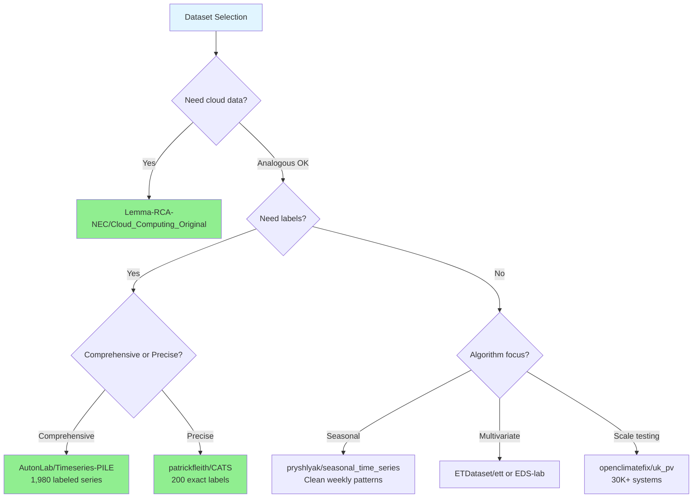
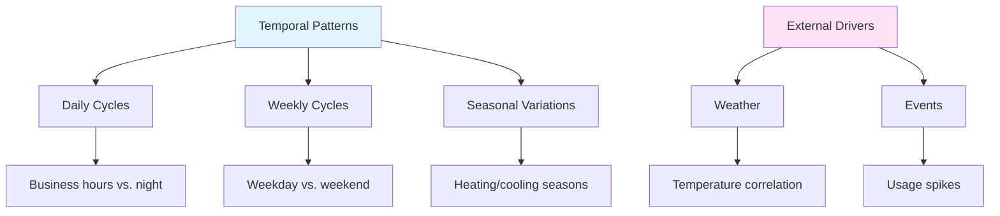

# Hugging Face Datasets for Cloud Resource Anomaly Detection

!!! info "Dataset Landscape Update"
    This comprehensive review covers 9 key datasets on Hugging Face for training and evaluating anomaly detection models applicable to [cloud resource monitoring](cloud-resource-patterns-research.md). Last updated: October 2025.

## TL;DR

**Bottom line:** Hugging Face offers several strong datasets for cloud resource anomaly detection modeling, though direct cloud infrastructure datasets are limited. The best options combine benchmark collections with labeled anomalies, real cloud platform data, and energy/resource domain datasets that closely parallel cloud behavior.

**Top recommendations:** For comprehensive benchmarking, use **AutonLab/Timeseries-PILE** (1,980 labeled anomaly time series including web server data). For actual cloud infrastructure, use **Lemma-RCA-NEC/Cloud_Computing_Original** (real cloud platform with 6 fault types). For algorithm development with strong seasonality, use **pryshlyak/seasonal_time_series_for_anomaly_detection** (explicit weekly patterns). Energy domain datasets (electricity demand, solar generation, grid monitoring) provide excellent cloud analogs with resource consumption patterns, daily/weekly cycles, and efficiency concerns matching cloud workloads.

**Key insight:** While dedicated multi-metric cloud datasets (CPU+memory+network combined) are scarce, energy and infrastructure monitoring datasets exhibit remarkably similar characteristics—resource consumption over time, strong temporal patterns from user/load behavior, anomalies from inefficiency or external events, and operational monitoring requirements. These domains provide robust training and evaluation data for cloud-focused anomaly detection research.

## Executive Summary with Dataset Comparison

The following table compares the most relevant datasets for cloud resource anomaly detection, ordered by direct applicability to cloud infrastructure monitoring:

| Dataset | Domain | Scale | Seasonality | Anomaly Labels | Cloud Relevance | Best For |
|---------|--------|-------|-------------|----------------|-----------------|----------|
| **Lemma-RCA-NEC/Cloud_Computing_Original** | Real cloud platform | Hundreds of entities | Daily/weekly cycles | ✅ Yes (6 fault types) | 🟢 **High** - Actual cloud data | Real cloud fault detection, RCA |
| **AutonLab/Timeseries-PILE** | Multi-domain benchmark | 1,980 labeled series (20GB) | Varies by domain | ✅ Yes (comprehensive) | 🟢 **High** - Web server subset | Comprehensive benchmarking |
| **pryshlyak/seasonal_time_series** | Synthetic seasonal | 67,700 points (3 months) | Strong weekly patterns | ✅ Yes (3 types) | 🟡 Medium - Generic patterns | Seasonal algorithm development |
| **patrickfleith/CATS** | Simulated system | 5M points, 17 variables | Process-driven cycles | ✅ Yes (200 precise) | 🟡 Medium - Multivariate | Multivariate method testing |
| **EDS-lab/electricity-demand** | Smart meters | Multi-building, hourly | Daily/weekly/seasonal + weather | ⚠️ No (find natural) | 🟡 Medium - Resource consumption | Resource usage patterns |
| **ETDataset/ett** | Electricity transformers | 2 years, 6 variables | Daily/seasonal + trends | ⚠️ No (predict failures) | 🟡 Medium - Infrastructure | Multi-timescale patterns |
| **openclimatefix/uk_pv** | Solar generation | 30,000+ systems (15 years) | Daily/seasonal strong | ⚠️ Partial (bad_data.csv) | 🟡 Medium - External impacts | Large-scale peer comparison |
| **electricity_load_diagrams** | Grid substations | 320 substations (4 years) | Daily/weekly/seasonal | ⚠️ No (find operational) | 🟡 Medium - Infrastructure | Multi-entity monitoring |
| **Time-MQA/TSQA** | QA-formatted | 37K anomaly QA pairs | Varies | ✅ Yes (QA format) | 🟡 Medium - AIOps included | LLM-based approaches |

**Legend:** 🟢 High relevance (direct cloud data or web servers) | 🟡 Medium relevance (analogous resource behavior) | ✅ Labeled | ⚠️ Unlabeled or partial

### Quick Selection Guide



**Need actual cloud data?** → Lemma-RCA-NEC/Cloud_Computing_Original + AutonLab/Timeseries-PILE (web server subset)

**Need labeled anomalies for supervised learning?** → AutonLab/Timeseries-PILE (1,980 series) or patrickfleith/CATS (200 precise labels)

**Developing seasonal anomaly detection?** → pryshlyak/seasonal_time_series (clean weekly patterns) → validate on EDS-lab/electricity-demand

**Testing multivariate methods?** → patrickfleith/CATS (controlled 17-var) → ETDataset/ett (real-world 6-var)

**Need large-scale evaluation?** → openclimatefix/uk_pv (30K+ systems) or electricity_load_diagrams (320 entities)

**Exploring LLM-based detection?** → Time-MQA/TSQA (37K QA pairs with AIOps domain)

---

## Detailed Dataset Analysis

**Hugging Face hosts several high-quality datasets suitable for time series anomaly detection modeling analogous to cloud resource usage behavior, though dedicated cloud infrastructure datasets remain limited.** The platform offers a mix of real-world operational data, energy consumption patterns, and purpose-built anomaly detection benchmarks—all exhibiting the seasonality, outliers, and temporal dynamics needed for robust anomaly detection research. The most promising datasets span industrial monitoring, energy systems, and large-scale benchmark collections with labeled anomalies.

!!! tip "Integration with Hello Cloud"
    All datasets reviewed here can be loaded and processed using our [PySpark-based data pipeline](../reference/index.md). See the notebooks section for examples of loading Hugging Face datasets with the `datasets` library and converting to Spark DataFrames.

## Most relevant datasets for cloud resource modeling

The datasets below most closely match cloud resource usage patterns with seasonal behavior and labeled anomalies, ordered by relevance to your use case.

### AutonLab/Timeseries-PILE: comprehensive multi-domain benchmark

This massive collection aggregates 13 million unique time series across 13 domains, specifically designed for foundation model training and evaluation. **The dataset's TSB-UAD (Time-Series Benchmark for Univariate Anomaly Detection) component contains 1,980 labeled time series from 18 anomaly detection datasets**, making it the most comprehensive anomaly detection resource on Hugging Face.

!!! example "Loading from Hugging Face"
    ``` python
    from datasets import load_dataset
    from hellocloud.spark import get_spark_session

    # Load the TSB-UAD subset for anomaly detection
    dataset = load_dataset("AutonLab/Timeseries-PILE", "TSB-UAD", split="train")

    # Convert to Spark DataFrame for distributed processing
    spark = get_spark_session(app_name="anomaly-benchmark")
    df = spark.createDataFrame(dataset.to_pandas())
    ```

**Dataset characteristics:** The collection spans 20.085 GB with 1.23 billion timestamps total, including data from healthcare, engineering, finance, environment, and critically, **web servers**—the domain most analogous to cloud infrastructure. The TSB-UAD subset provides both synthetic and real-world anomalies with high variability in types, ratios, and sizes. The dataset also includes the Informer forecasting collection with electricity transformer temperature data, traffic patterns, and weather data—all exhibiting resource-like temporal dynamics.

**Seasonality patterns:** Temporal patterns vary by subdataset but comprehensively cover daily cycles, weekly patterns, and seasonal variations. Web server data within TSB-UAD exhibits usage patterns directly comparable to cloud resources. The electricity and traffic datasets demonstrate clear periodic behavior with load-dependent variations.

**Anomaly types:** The labeled anomalies span point anomalies (sudden spikes), collective anomalies (sustained unusual patterns), and contextual anomalies (unusual given temporal context). These mirror the anomaly types in cloud environments: point anomalies resemble sudden resource spikes, collective anomalies match degraded performance periods, and contextual anomalies reflect unusual usage given time-of-day expectations.

**Why suitable for cloud resource modeling:** Web server metrics inherently parallel cloud resource behavior—both exhibit request-driven load patterns, have clear daily/weekly seasonality from user activity, and experience anomalies from traffic surges, system failures, or external events. The diversity of 18 source datasets prevents overfitting to specific patterns while the large scale (1,980 labeled series) enables robust model training and evaluation.

!!! success "Research Validation"
    This dataset addresses the [quality concerns](https://arxiv.org/abs/2009.13807) identified by Wu & Keogh (2020) in traditional anomaly detection benchmarks, providing carefully curated ground truth labels and realistic anomaly characteristics.

**Preprocessing considerations:** The dataset comes standardized for the MOMENT foundation model framework but remains accessible via standard tools. Use the TSB-UAD subset specifically for anomaly detection tasks. The data varies in length and amplitude across sources, so normalization by time series is recommended. The collection provides ready-to-use train/test splits, eliminating common temporal leakage issues. **Downloaded 28,200 times**, indicating strong community validation.

### Lemma-RCA-NEC/Cloud_Computing_Original: real cloud platform data

This dataset provides actual system metrics and logs from a cloud computing platform with **six real fault types injected across hundreds of system entities**—making it the most directly applicable to cloud resource anomaly detection on Hugging Face.

!!! warning "Dataset Access Considerations"
    This dataset requires JSON parsing and has a CC-BY-ND-4.0 license restricting derivative works. The dataset viewer shows errors, so programmatic access via the `datasets` library is recommended. Consider this for evaluation rather than training data augmentation.

**Dataset characteristics:** The data comes in JSON format containing both system metrics (performance measurements) and logs (event data) from a production cloud computing environment. The dataset captures real operational conditions with hundreds of interconnected system entities, reflecting the complexity of actual cloud infrastructure. While the exact size isn't specified, the multimodal nature (metrics + logs) provides rich context for anomaly detection.

**Fault types labeled:** The dataset includes six critical cloud failure modes:

| Fault Type | Category | Impact on Resources |
|-----------|----------|---------------------|
| Cryptojacking | Security | Unauthorized CPU/GPU usage |
| Silent Pod Degradation | Performance | Gradual efficiency decay |
| Malware Attacks | Security | Resource consumption anomalies |
| GitOps Mistakes | Configuration | Deployment failures |
| Configuration Change Failures | Operational | Service disruption |
| Bug Infections | Reliability | Unpredictable behavior |

**These represent real-world cloud anomalies** spanning security breaches, performance degradation, and operational errors—precisely the types of inefficiencies and external impacts relevant to cloud resource monitoring.

**Seasonality patterns:** Cloud computing platforms naturally exhibit strong temporal patterns from user activity. Workloads typically show pronounced daily cycles (business hours vs. night), weekly patterns (weekday vs. weekend usage), and potential seasonal variations from business cycles or world events. The time-series format with timestamps enables analysis of these periodic patterns.

**Why suitable:** This dataset directly addresses the cloud resource use case unlike other datasets that require analogy. The fault types mirror real cloud anomalies: cryptojacking represents inefficient resource usage, pod degradation shows performance issues, and the others reflect external impacts from attacks or human errors. The multi-entity structure parallels distributed cloud architectures with many interconnected services.

**Preprocessing considerations:** The JSON format requires parsing into time-series structure. Given hundreds of entities, feature selection or dimensionality reduction may be necessary. The dataset is designed for Root Cause Analysis (RCA), providing attribution for which entities are affected by each fault—valuable for understanding anomaly propagation in distributed systems. Note the CC-BY-ND-4.0 license restricts derivative works. The dataset viewer has errors, so programmatic access via the datasets library is recommended.

### pryshlyak/seasonal_time_series_for_anomaly_detection: explicit seasonality focus

**This dataset was explicitly designed for seasonal anomaly detection**, making it ideal for developing and testing algorithms that leverage periodic patterns. Based on the [Numenta Anomaly Benchmark](https://github.com/numenta/NAB) but restructured to emphasize weekly seasonality, it provides clean labeled data for methodical algorithm development.

!!! tip "Prototyping Recommendation"
    Start algorithm development here due to the clean structure and explicit seasonality, then validate on messier real-world datasets like EDS-lab/electricity-demand. The controlled environment isolates algorithm behavior from data quality issues.

**Dataset characteristics:** The dataset contains 67,700 rows with 5-minute sampling intervals spanning three months. **Data is organized by day of week** (seven separate CSVs for Monday-Sunday with 3,745 rows each) plus weekly aggregations (2,017 rows each). This structure directly supports periodicity-based anomaly detection approaches. The format is minimal—timestamp and value columns only—keeping focus on temporal patterns.

**Seasonality patterns:** The dataset exhibits **strong weekly periodicity** with distinct patterns for each weekday, directly analogous to cloud resources that experience different usage on weekdays versus weekends. The 5-minute granularity captures intra-day variations like morning startup, lunch dips, and evening shutdowns common in business applications. The three-month span covers sufficient cycles for learning robust seasonal patterns.

**Anomaly characteristics:** Training data includes seven weekday files and one normal week file with no anomalies—ideal for unsupervised learning. Testing data contains three types:

=== "Collective Downward"
    **Monday file** - Sustained performance degradation

    Analogous to: Resource underutilization, service degradation, capacity issues

=== "Collective Upward"
    **Wednesday file** - Traffic surge patterns

    Analogous to: Unusual demand spikes, DDoS attacks, viral content

=== "Point Anomaly"
    **Saturday file** - Sudden isolated spikes

    Analogous to: Batch job failures, configuration errors, transient faults

These anomaly types directly map to cloud resource scenarios documented in our [cloud resource patterns research](cloud-resource-patterns-research.md).

**Why suitable:** The explicit seasonal structure mirrors cloud workloads where different days exhibit different patterns—weekday business traffic differs from weekend consumer traffic. The clean separation of training (normal) and testing (anomalous) data supports supervised, semi-supervised, and unsupervised approaches. The dataset's design for auto-encoder training generalizes to any anomaly detection technique exploiting periodicity.

**Preprocessing considerations:** Data is pre-cleaned with no missing values and positive-only values. The day-of-week split enables training separate models per period—the thesis approach—or pooling for general models. Timestamps are artificial (January-March 2024) so absolute dates don't matter, only relative temporal positions. **Best for developing seasonal algorithms** before applying to messier real-world data. Consider this a controlled environment for algorithm validation.

### patrickfleith/controlled-anomalies-time-series-dataset (CATS): multivariate precision

For researchers needing multivariate anomaly detection with precise ground truth, CATS provides **200 exactly labeled anomalies across 17 variables in a 5-million-point simulated system**—offering unprecedented control for rigorous algorithm evaluation.

**Dataset characteristics:** CATS simulates a complex dynamical system (analogous to industrial control systems or building management) with **17 variables** split into 4 control commands, 3 environmental stimuli, and 10 telemetry readings (temperature, pressure, voltage, current, position, velocity, acceleration, humidity). The 1Hz sampling rate provides second-by-second resolution over an extended operational period. The first 1 million points contain only nominal behavior (ideal for unsupervised training), while the next 4 million mix normal and anomalous segments.

**Seasonality patterns:** The simulated system exhibits operational cycles from the control logic and environmental interactions—periodic patterns from processes like heating/cooling cycles, position movements, or state machines. While not traditional daily/weekly seasonality, these represent the **process-driven periodicity** found in automated systems, directly relevant to auto-scaling cloud resources or scheduled batch jobs.

**Anomaly characteristics:** All 200 anomalies include precise metadata: exact start/end times, root cause channel, affected channels, and anomaly category. **This eliminates the ground truth ambiguity** plaguing many benchmark datasets. The anomalies have controlled injection, meaning researchers can isolate algorithm performance from data quality issues. Metadata supports root cause analysis—identifying not just that an anomaly occurred but which variable caused it and which variables were affected.

**Why suitable for cloud modeling:** Modern cloud environments are increasingly multivariate—CPU, memory, network, disk I/O, latency, and error rates all interact. CATS's multivariate structure with known dependencies mirrors this. The control commands parallel API calls or configuration changes that affect system state. Environmental stimuli represent external load or conditions. Telemetry readings parallel observability metrics. The **pure signal with no noise** provides a baseline; researchers can add custom noise levels to test robustness—valuable for understanding algorithm behavior under varying data quality.

**Preprocessing considerations:** The dataset is pristine with no missing data—unrealistic for production but perfect for controlled experiments. Add synthetic noise or missing data windows to test real-world resilience. The root cause labels enable evaluation of not just detection but attribution algorithms. Use the first 1 million points for semi-supervised approaches (novelty detection) or include contamination for unsupervised scenarios. The multivariate nature requires techniques handling variable interactions—VAE, LSTM-VAE, or graph neural networks.

## Energy and resource utilization datasets

These datasets from energy domains provide excellent analogs to cloud resources given their strong seasonality, resource-like behavior, and operational monitoring nature.

!!! note "Energy-Cloud Parallels"
    Energy datasets share key characteristics with cloud resources: resource consumption over time, strong temporal patterns from user behavior, efficiency optimization goals, and operational monitoring requirements. Our [cloud resource correlations research](cloud-resource-correlations-report.md) demonstrates similar multivariate correlation structures.

### EDS-lab/electricity-demand: multivariate smart meter data

Smart meter electricity consumption closely parallels cloud resource consumption—both represent resource usage over time, exhibit strong temporal patterns, and experience demand variations from user behavior and external conditions.

**Dataset characteristics:** This harmonized collection aggregates multiple smart meter datasets with hourly sampling across residential and commercial buildings. The data comes in three components: demand.parquet (consumption time series with unique_id, timestamp, y in kWh), metadata.parquet (building_class, cluster_size, location), and weather.parquet (**25+ weather variables** including temperature, humidity, precipitation, solar radiation, wind speed). The multi-building structure provides numerous parallel time series for comparative analysis.

**Seasonality patterns:** Electricity demand shows pronounced patterns directly analogous to cloud resources:



**Daily cycles** reflect business hours for commercial buildings or home activity for residential—matching cloud application usage. **Weekly cycles** distinguish weekdays from weekends—mirroring reduced weekend traffic for business applications. **Seasonal variations** from heating/cooling loads parallel seasonal e-commerce patterns (holiday shopping) or tax season spikes. The strong correlation with weather (temperature especially) demonstrates how external factors drive consumption—just as world events or viral content drive cloud traffic.

**Anomaly opportunities:** While unlabeled, natural anomalies abound: equipment malfunctions (sudden drops or spikes), unusual consumption (vacant building with high usage suggesting waste), meter reading errors (negative values or impossibly high readings), or **weather-adjusted anomalies** (high usage on mild day). The weather covariates enable sophisticated contextual anomaly detection—flagging consumption unusual for the conditions, analogous to detecting high cloud resource usage during low user activity periods.

**Why suitable:** The parallels are strong: both are resource consumption metrics with strong time-of-day/day-of-week patterns, both have a "correct" expected baseline with deviations indicating issues, both are influenced by external factors (weather vs. user behavior), and both seek to identify inefficient usage. The building metadata enables clustering similar usage profiles—like grouping similar microservices or customer workloads.

**Preprocessing for anomaly detection:** The rich weather covariates suggest multivariate anomaly detection incorporating context. Normalize consumption by building capacity or size for fair comparison. Use the multiple buildings for peer-comparison approaches—flagging buildings as anomalous if they deviate from similar buildings. The location data enables spatial analysis. **Test algorithms for weather-adjusted anomaly detection**—a valuable capability for cloud resources when expected load varies by time or external factors. Licensed under BSD 3-clause for flexible use.

### ETDataset/ett: electricity transformer temperature

This dataset provides **2 years of electricity transformer operational data** from critical infrastructure—equipment failure here has severe consequences, making anomaly detection crucial.

!!! quote "Foundation Model Benchmark"
    From the [Informer paper](https://arxiv.org/abs/2012.07436) (AAAI 2021 Best Paper): "ETT datasets exhibit multi-scale periodic patterns with long-term trends, providing a rigorous benchmark for time series forecasting models."

**Dataset characteristics:** Four variants (ETT-h1, ETT-h2, ETT-m1, ETT-m2) from two transformers at two stations provide both hourly (17,520 points) and 15-minute (70,080 points) resolution data spanning 2016-2018. The target variable is Oil Temperature (OT), a critical safety indicator—overheating damages transformers. Six load features provide context: High/Middle/Low UseFul Load and High/Middle/Low UseLess Load, capturing the transformer's operating conditions.

**Seasonality patterns:** The dataset explicitly exhibits **short-term periodical patterns** (daily load cycles from grid usage), **long-term periodical patterns** (seasonal variations from weather-dependent demand), **long-term trends** (equipment aging/degradation), and **complex irregular patterns**. This combination of pattern types makes it excellent for testing robust algorithms that must handle multiple timescales—exactly the challenge in cloud resources with daily patterns, weekly patterns, and long-term growth trends.

**Anomaly detection value:** Oil temperature anomalies indicate transformer malfunction risk—overheating from excess load, cooling system failure, or internal electrical issues. These parallel cloud resource anomalies: excess load, insufficient capacity, or component failures. **False predictions can damage equipment**—the same high-stakes environment as cloud anomaly detection where false alarms cause alert fatigue and missed detections cause outages.

**Why suitable:** The load features + temperature structure mirrors cloud metrics (CPU/memory/network load + response time/error rate). Both domains involve resource allocation, capacity planning, and failure prevention. The multi-transformer setup provides multiple parallel series for comparative analysis. The predictive maintenance application—detecting issues before failure—directly parallels cloud workload management.

**Preprocessing considerations:** Pre-split into train/val/test (12/4/4 months) for consistent evaluation. The multivariate structure (6 load features + temperature) enables testing correlation-based anomaly detection—flagging temperature unusual given load conditions. The 15-minute variants provide higher resolution for detecting rapid-onset anomalies. Use the long-term trends to test algorithms robust to non-stationarity. **Well-documented and widely used** in time series research (from the Informer paper), ensuring reproducibility. CC-BY-4.0 license.

### openclimatefix/uk_pv: large-scale solar generation

With **over 30,000 solar PV systems tracked from 2010-2025**, this dataset provides exceptional scale for anomaly detection research, plus partial ground truth via labeled bad data periods.

!!! note "Dataset Access"
    **Gated dataset** requiring approval: [openclimatefix/uk_pv on Hugging Face](https://huggingface.co/datasets/openclimatefix/uk_pv)

    DOI: [10.57967/hf/0878](https://doi.org/10.57967/hf/0878) | Access is readily granted for research purposes.

**Dataset characteristics:** The dataset covers 15 years of domestic solar installations across Great Britain with two resolution levels: 30-minute intervals (30,000+ systems, high quality cumulative energy) and 5-minute intervals (1,309 systems, instantaneous but noisy). Systems range from 0.47 kW to 250 kW capacity. Metadata includes latitude/longitude, panel orientation, tilt angle, and capacity. Critically, **bad_data.csv identifies known periods of data quality issues**—providing partial ground truth for anomaly detection evaluation.

**Seasonality patterns:** Solar generation exhibits the strongest possible seasonal patterns: **zero nighttime generation**, **predictable daily curves** (sunrise ramp, midday peak, sunset decline), **seasonal variation** (long summer days, short winter days), and **weather dependency** (cloud cover causes rapid generation drops). Geographic spread across Britain provides diverse weather patterns. These characteristics parallel cloud resources with predictable baseline patterns disrupted by external events—like solar generation disrupted by clouds, cloud resources are disrupted by traffic events.

**Anomaly characteristics:** The bad_data.csv provides labeled anomalies including: equipment malfunctions, negative generation values (sensor errors), excessive values (>750× capacity, clearly impossible), nighttime generation (indicates clock errors), and zero generation during sunny periods (equipment failure). Beyond these labeled cases, natural unlabeled anomalies exist from inverter failures, panel degradation, shading issues, and soiling (dirt reducing output).

**Why suitable:** The massive scale (30,000+ systems) enables testing at cloud-scale where thousands of services or instances require monitoring. The partial ground truth balances labeled data for validation with unlabeled realistic data for unsupervised approaches. The geospatial dimension enables peer-comparison anomaly detection—flagging systems underperforming compared to nearby systems with similar conditions. The **real-world messiness** (missing data, quality issues) mirrors production cloud data.

**Preprocessing considerations:** Extensive data cleaning guidance is provided. Use bad_data.csv as ground truth test set. Normalize generation by kWp capacity for fair comparison across system sizes. The location data enables clustering by geographic region or weather patterns. Handle missing midnight readings and gaps documented in the dataset. The 5-minute data is noisy—test algorithm robustness to noise. **Gated dataset** requiring access approval, but readily granted for research. DOI: 10.57967/hf/0878.

### electricity_load_diagrams: substation monitoring

This dataset provides **4 years of Portuguese electricity grid substation data** with 370 substations sampled every 15 minutes—a scale and operational focus directly relevant to infrastructure monitoring.

**Dataset characteristics:** Originally 15-minute sampling resampled to hourly, spanning 2011-2014. The LSTNet benchmark configuration uses 320 substations active during 2012-2014, providing consistent time series for algorithm comparison. The data captures actual grid load in kW across a national electricity system—critical infrastructure where anomalies indicate equipment issues, unexpected demand, or grid instability.

**Seasonality patterns:** Electricity grid load exhibits textbook periodicity: **24-hour daily cycles** (morning ramp-up, evening peak, overnight minimum), **weekly patterns** (weekday business/industrial load vs. weekend residential-dominated load), and **seasonal variations** (summer air conditioning, winter heating). These patterns mirror cloud infrastructure serving business applications with clear usage rhythms.

**Anomaly opportunities:** Though unlabeled, natural anomalies include equipment failures (sudden drops), unexpected demand (unusual spikes), grid instability (rapid fluctuations), or seasonal anomalies (unusual load for the weather). The dataset documents known quirks: daylight saving time transitions create 23-hour days (March) and 25-hour days (October)—realistic complications that anomaly detectors must handle. **No missing values** simplifies initial development.

**Why suitable:** Multiple substations enable comparative anomaly detection—identifying substations behaving differently from peers. The hourly resolution matches common cloud metric collection intervals. The 4-year span covers sufficient seasonal cycles for learning robust patterns. The infrastructure monitoring domain parallels cloud monitoring—both involve critical systems requiring high availability where anomalies indicate serious issues.

**Preprocessing considerations:** Account for daylight saving transitions where March has zeros 1-2am (23 hours) and October aggregates 1-2am (25 hours). The resampling to hourly from 15-minute data smooths some noise but may miss rapid anomalies—consider accessing original 15-minute data if available. Use the LSTNet configuration (320 substations, 2012-2014) for benchmark comparison. The dataset is clean and well-documented, used in multiple research papers for validation. Source: UCI Machine Learning Repository.

## Specialized and QA-format datasets

### Time-MQA/TSQA: LLM-based anomaly detection

This unique dataset reformulates time series tasks as question-answering pairs, enabling LLM-based approaches to anomaly detection—a frontier research direction.

**Dataset characteristics:** Approximately 200,000 QA pairs across 12 real-world domains with **37,000 instances specifically for anomaly detection**. The dataset includes healthcare (EEG, ECG), finance, energy, IoT, environment, transport, web traffic, and critically **AIOps (cloud monitoring)** domain. Multiple formats are provided: 6,919 true/false questions, 11,281 multiple-choice questions, and 12,510 open-ended questions. Pre-trained models are available (Mistral 7B, Qwen-2.5 7B, Llama-3 8B).

**Why relevant:** The AIOps domain explicitly includes cloud monitoring data formatted for question answering. This enables approaches where models reason about time series rather than just pattern-match—answering questions like "Is this usage pattern anomalous given it's Monday morning?" or "What caused this traffic spike?" The multi-task format (forecasting, imputation, anomaly detection, classification, open-ended reasoning) enables transfer learning where representations learned from one task improve others.

**Use case:** For researchers exploring LLM-based anomaly detection or multi-task time series models, this provides ready-to-use training data. The context enhancement (auxiliary textual descriptions) helps models understand domain semantics—e.g., explaining that Monday mornings typically have high traffic helps contextual anomaly detection. **Downloaded 262 times** despite recent publication (ACL 2025), indicating strong interest.

**Preprocessing considerations:** The QA format requires different architectures than traditional time series models—use sequence-to-sequence models or LLMs fine-tuned on time series. The dataset is designed for continued pre-training of foundation models. Consider how to convert raw time series into this format if generating additional training data. The multiple-choice and true/false formats enable classification-based evaluation.

## Dataset selection guidance

### For researchers prioritizing real cloud infrastructure data

**Primary choice:** Lemma-RCA-NEC/Cloud_Computing_Original provides actual cloud platform metrics with real fault types, though limited documentation requires hands-on exploration. Supplement with AutonLab/Timeseries-PILE's web server data for additional cloud-analogous patterns.

### For algorithm development emphasizing seasonality

**Primary choice:** pryshlyak/seasonal_time_series_for_anomaly_detection offers clean, explicitly seasonal data ideal for developing and validating periodicity-based algorithms. Once proven on this controlled dataset, test on messier real-world data like EDS-lab/electricity-demand or electricity_load_diagrams.

### For comprehensive benchmarking

**Primary choice:** AutonLab/Timeseries-PILE provides the most extensive benchmark with 1,980 labeled anomaly time series from 18 datasets. The TSB-UAD subset specifically addresses dataset quality issues plaguing older benchmarks. Use this for broad evaluation across diverse patterns and anomaly types.

### For multivariate anomaly detection research

**Primary choice:** patrickfleith/controlled-anomalies-time-series-dataset (CATS) offers 17 variables with precise root cause labels—ideal for developing and testing multivariate algorithms. Follow with ETDataset/ett for real-world multivariate data at scale.

### For large-scale evaluation

**Primary choice:** openclimatefix/uk_pv with 30,000+ systems tests algorithmic scalability and peer-comparison approaches. Alternatively, electricity_load_diagrams with 320 substations provides a smaller but still substantial multi-entity dataset.

## Key preprocessing considerations across datasets

!!! warning "Temporal Leakage Prevention"
    **Always use temporal splits**, never random splits. Time series have temporal dependencies making random splits leak information. Ensure training data precedes test data chronologically. For semi-supervised approaches, training should contain only normal data (or <5% contamination).

### Normalization approaches

Most datasets benefit from per-time-series normalization (z-score standardization) to account for different scales—one building's 10 kW load differs from another's 1000 kW load, but both may show similar relative patterns. For datasets with metadata (capacity, size), consider normalizing by these physical properties. For multivariate datasets like CATS or ETT, normalize each variable independently to prevent high-magnitude variables dominating.

```python
from pyspark.sql import functions as F

# Per-series z-score normalization
df_normalized = df.withColumn(
    "value_normalized",
    (F.col("value") - F.mean("value").over(Window.partitionBy("series_id"))) /
    F.stddev("value").over(Window.partitionBy("series_id"))
)
```

### Handling seasonality

Algorithms exploiting seasonality require sufficient cycles for learning—at least 2-3 complete periods. For daily patterns, 2-3 days suffices; for weekly patterns, 2-3 weeks; for seasonal patterns, 1-2 years. Use techniques like seasonal decomposition (STL) to explicitly model and remove seasonality, with residuals analyzed for anomalies. Alternatively, use day-of-week and hour-of-day encodings as features. The pryshlyak dataset's pre-split by weekday demonstrates one approach.

=== "STL Decomposition"
    ``` python
    from statsmodels.tsa.seasonal import STL

    # Decompose into trend, seasonal, residual
    stl = STL(time_series, seasonal=169)  # 169 = weekly for hourly data
    result = stl.fit()

    # Detect anomalies in residuals
    anomalies = result.resid > 3 * result.resid.std()
    ```

=== "Feature Engineering"
    ``` python
    from pyspark.sql import functions as F

    # Add temporal features
    df_features = df.withColumn(
        "hour_of_day", F.hour("timestamp")
    ).withColumn(
        "day_of_week", F.dayofweek("timestamp")
    ).withColumn(
        "is_weekend", F.dayofweek("timestamp").isin([1, 7])
    )
    ```

### Train/test splitting

**Always use temporal splits**, not random splits—time series have temporal dependencies making random splits leak information. The typical split is chronological: first 60-70% training, remaining testing. Ensure training data precedes test data temporally. For semi-supervised approaches, training should contain only normal data (or <5% contamination). For unsupervised approaches, training may include realistic anomaly rates.

### Missing data strategies

Real-world datasets like openclimatefix/uk_pv have missing readings common in production. Strategies include: forward-fill for short gaps (carry last valid value), interpolation for medium gaps (linear or spline), masking and imputation modeling for long gaps, or excluding time series with excessive missingness. Test algorithm robustness to missing data patterns. CATS's completeness provides a baseline; add synthetic gaps to test handling.

### Dealing with unlabeled data

Most energy and resource datasets lack anomaly labels—use these for unsupervised approaches (isolation forest, LOF, autoencoders) or semi-supervised approaches (one-class SVM, VAE). Alternatively, use domain knowledge to label obvious anomalies (e.g., negative electricity generation, usage 10× typical) or leverage labeled datasets for training with transfer learning to unlabeled domains.

### Window size selection

Sliding window approaches are common—window size should capture complete patterns. For detecting daily anomalies, use 24-hour windows (24 points for hourly data). For point anomalies, smaller windows (10-50 points) suffice. For collective anomalies spanning hours or days, larger windows (100-500 points) are needed. The ETT dataset's dual 15-minute and hourly resolution enables testing different granularities.

## Important gaps and limitations

!!! danger "Dataset Quality Concerns"
    Recent research ([Wu & Keogh 2020](https://arxiv.org/abs/2009.13807), [Liu & Paparrizos 2024](https://arxiv.org/abs/2401.00001)) identified serious quality issues in traditional anomaly detection benchmarks: anomalies too obvious, unrealistic anomaly densities, mislabeled ground truth, and run-to-failure bias. **Prioritize TSB-UAD and CATS** which specifically address these concerns.

### Limited dedicated cloud resource datasets

Despite the strong need, **comprehensive multi-metric cloud resource datasets (CPU + memory + network + disk I/O combined) are scarce on Hugging Face**. Researchers must rely on analogous domains (energy, industrial) or the single Lemma-RCA-NEC cloud dataset with limited documentation. Classic benchmarks like [SMD (Server Machine Dataset)](https://github.com/NetManAIOps/OmniAnomaly) and [PSM (Pooled Server Metrics)](https://github.com/eBay/RANSynCoders) are not on Hugging Face, requiring GitHub or Kaggle sources.

### Seasonality documentation sparse

Few datasets explicitly document seasonal patterns beyond pryshlyak's dataset. Researchers must analyze other datasets to confirm periodicity presence and characteristics—EDS-lab and openclimatefix note seasonality in descriptions, but specific period strengths aren't quantified. Consider exploratory analysis (autocorrelation, FFT) before selecting datasets for seasonal algorithm development.

### Classic benchmarks absent

Widely-cited benchmarks like [NAB](https://github.com/numenta/NAB), [Yahoo S5](https://webscope.sandbox.yahoo.com/), [SMAP/MSL](https://github.com/khundman/telemanom), [SWaT](https://itrust.sutd.edu.sg/), [WADI](https://itrust.sutd.edu.sg/) are **not directly available on Hugging Face**—they exist on GitHub, via direct access requests, or through aggregations like Timeseries-PILE. Researchers wanting these specific datasets must obtain them separately, though Timeseries-PILE includes many in processed form.

??? note "External Dataset Sources"
    | Benchmark | Source | Access |
    |-----------|--------|--------|
    | NAB (Numenta) | [GitHub](https://github.com/numenta/NAB) | Public |
    | Yahoo S5 | [Webscope](https://webscope.sandbox.yahoo.com/) | Registration required |
    | SMAP/MSL | [GitHub](https://github.com/khundman/telemanom) | Public |
    | SMD | [GitHub](https://github.com/NetManAIOps/OmniAnomaly) | Public |
    | PSM | [GitHub](https://github.com/eBay/RANSynCoders) | Public |
    | SWaT/WADI | [iTrust](https://itrust.sutd.edu.sg/) | Request required |

### Synthetic vs. real-world tradeoff

Datasets with cleanest labels and strongest seasonality (pryshlyak, CATS) are **synthetic or simulated**—they lack real-world messiness. Real-world datasets (electricity-demand, uk_pv, cloud_computing) have authentic complexity but limited or no labels and sparse documentation. Choose based on research stage: controlled synthetic for algorithm development, messy real-world for validation.

### Dataset quality concerns

Recent research (Wu & Keogh 2020, Liu & Paparrizos 2024) identified serious quality issues in traditional anomaly detection benchmarks: anomalies too obvious, unrealistic anomaly densities, mislabeled ground truth, and run-to-failure bias. The TSB-UAD and CATS datasets specifically address these concerns with careful curation and precise injection, respectively—prioritize these for rigorous evaluation over less-validated datasets.

!!! tip "Quality Validation Checklist"
    Before selecting a dataset, verify:

    - [ ] Anomaly labels are precise and independently validated
    - [ ] Anomaly density is realistic (<10% typically)
    - [ ] Multiple anomaly types represented (point, collective, contextual)
    - [ ] Documentation includes data collection methodology
    - [ ] Community validation (download counts, citations)

## Conclusion

Hugging Face hosts several strong options for time series anomaly detection research applicable to cloud resource monitoring, though direct cloud datasets remain limited. **AutonLab/Timeseries-PILE provides the most comprehensive starting point** with 1,980 labeled anomaly time series including web server data, while **Lemma-RCA-NEC/Cloud_Computing_Original offers the most direct cloud infrastructure data** despite documentation gaps. For algorithm development, **pryshlyak/seasonal_time_series_for_anomaly_detection delivers explicit seasonality** in a clean format, and **patrickfleith/controlled-anomalies-time-series-dataset enables rigorous multivariate evaluation** with precise ground truth.

Energy domain datasets (EDS-lab/electricity-demand, ETDataset/ett, openclimatefix/uk_pv, electricity_load_diagrams) provide excellent analogs given their resource-like behavior, strong seasonality, and operational monitoring nature—the temporal patterns, external influences, and efficiency concerns directly parallel cloud resources. Combined with the benchmark collections, researchers have sufficient variety to develop, validate, and test anomaly detection algorithms for cloud-analogous time series before deploying to production cloud environments. The datasets span scales from controlled 67k-row experiments to massive 30,000-system deployments, enabling research at multiple stages from proof-of-concept to production readiness.

!!! success "Next Steps"
    - **Start prototyping:** Use pryshlyak/seasonal_time_series for clean algorithm development
    - **Validate comprehensively:** Benchmark on AutonLab/Timeseries-PILE TSB-UAD subset
    - **Test at scale:** Evaluate on openclimatefix/uk_pv (30K+ systems) or electricity_load_diagrams (320 substations)
    - **Integrate with hello cloud:** See [data generation modules](../reference/index.md) for combining real and synthetic data

---

## Additional Resources

- **Dataset Aggregations:** [Awesome Time Series Anomaly Detection](https://github.com/rob-med/awesome-TS-anomaly-detection)
- **Evaluation Tools:** [TSB-UAD Benchmark](https://github.com/TheDatumOrg/TSB-UAD)
- **Foundation Models:** See our [OpenTSLM evaluation](opentslm-foundation-model-evaluation.md) for zero-shot anomaly detection
- **Related Research:** [Cloud resource patterns](cloud-resource-patterns-research.md) | [Multivariate correlations](cloud-resource-correlations-report.md)
